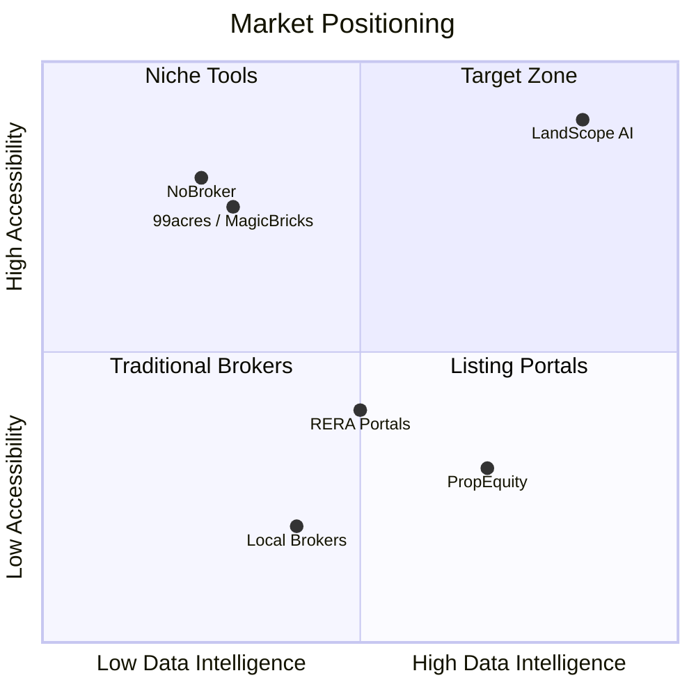
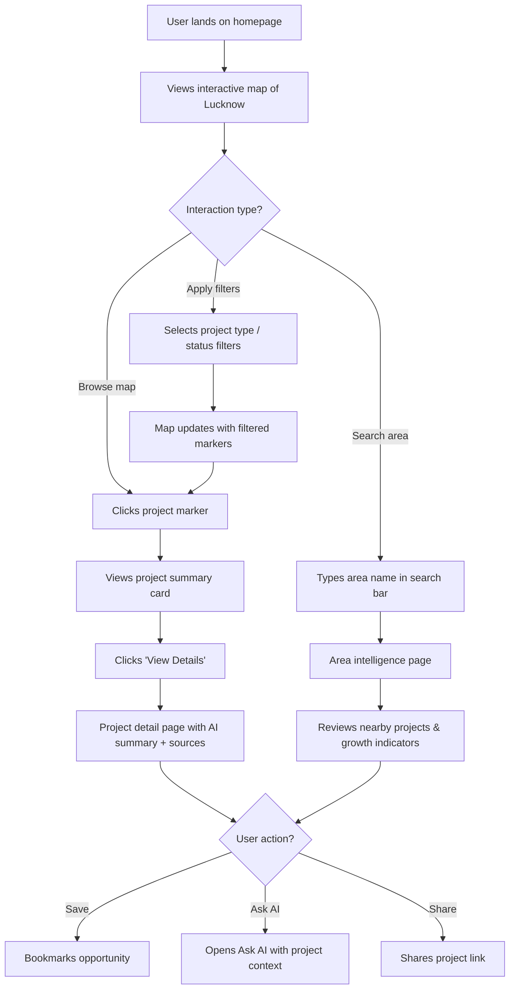
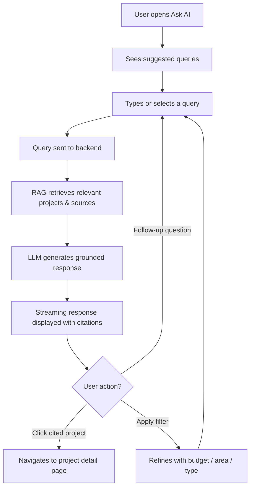
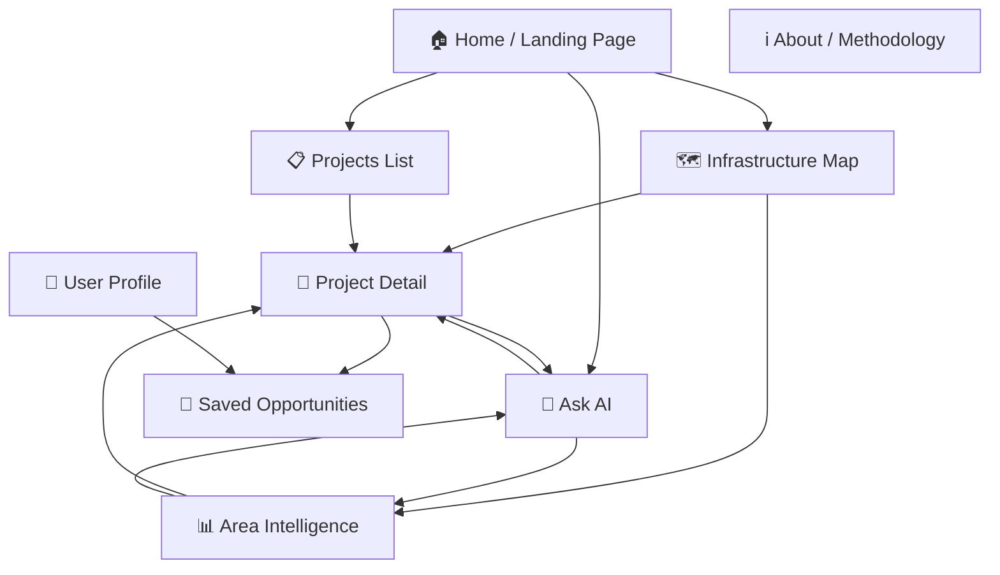

# LandScope AI — Product Requirements Document (PRD)

| Field | Detail |
|-------|--------|
| **Product Name** | LandScope AI |
| **Document Version** | 1.0 |
| **Author** | Product Team |
| **Date** | June 2026 |
| **Status** | Draft |
| **Stakeholders** | Engineering, Design, Data, AI/ML |

---

## 1. Executive Summary

LandScope AI is an **AI-powered Property Intelligence Platform** that aggregates, verifies, and visualises upcoming government infrastructure projects to help ordinary Indian citizens discover high-growth real-estate opportunities before prices appreciate.

> *"Know where the city is growing — before prices move."*

The MVP targets **Lucknow** and delivers an interactive infrastructure map, source-verified project data, AI-generated summaries, area intelligence, and a conversational Ask AI feature — all within a **1-week sprint**.

---

## 2. Problem Statement

### 2.1 Background

In India, infrastructure and urban development projects (metro expansions, expressways, smart cities, IT parks, etc.) significantly impact surrounding land and property prices. However, this information is **fragmented** across government websites, authority notices, news articles, tenders, master plans, and public documents.

### 2.2 The Gap

By the time the average citizen becomes aware of these developments, institutional investors, brokers, and politically connected individuals have already purchased nearby properties. **Middle-class buyers, first-time home buyers, and small investors** consistently miss high-growth opportunities.

### 2.3 Core Problem

There is no trusted platform that:

1. Aggregates upcoming government and infrastructure projects
2. Verifies projects using official sources
3. Maps projects geographically
4. Explains potential impact on nearby land and property values
5. Helps users discover growth opportunities before prices increase
6. Provides transparent, legal, and source-backed information

---

## 3. Product Vision & Strategy

### 3.1 Vision

> Build an AI-powered Property Intelligence Platform that helps ordinary citizens make informed real-estate decisions using verified public information.

### 3.2 Strategic Positioning

### 3.3 Competitive Differentiation

| Capability | 99acres / MagicBricks | NoBroker | RERA Portals | **LandScope AI** |
|------------|----------------------|----------|--------------|-------------------|
| Property listings | ✅ | ✅ | ✅ | ❌ (not a listing platform) |
| Infrastructure project data | ❌ | ❌ | ❌ | ✅ |
| Source verification | ❌ | ❌ | Partial | ✅ |
| Geographic mapping | Basic | Basic | ❌ | ✅ (project-centric) |
| AI-generated insights | ❌ | ❌ | ❌ | ✅ |
| Growth prediction | ❌ | ❌ | ❌ | ✅ |
| Conversational AI | ❌ | ❌ | ❌ | ✅ |
| Opportunity scoring | ❌ | ❌ | ❌ | ✅ (Phase 2) |

---

## 4. Target Users

### 4.1 User Personas

#### Persona 1 — Rahul (First-Time Home Buyer)

| Attribute | Detail |
|-----------|--------|
| **Age** | 28–35 |
| **Occupation** | IT professional in Lucknow |
| **Income** | ₹8–15 LPA |
| **Goal** | Buy a first home in a growth corridor before prices rise |
| **Pain Points** | Doesn't know which areas will develop next; overwhelmed by broker claims; can't verify infrastructure announcements |
| **Behaviour** | Researches online, reads news, asks colleagues; decision paralysis from conflicting information |

#### Persona 2 — Meena (Middle-Class Investor)

| Attribute | Detail |
|-----------|--------|
| **Age** | 40–55 |
| **Occupation** | Government employee / small business owner |
| **Income** | ₹6–12 LPA |
| **Goal** | Invest ₹10–25 lakh in land near upcoming infrastructure for long-term appreciation |
| **Pain Points** | Lacks insider connections; doesn't trust broker information; misses opportunities due to late awareness |
| **Behaviour** | Reads Hindi newspapers, follows local development news, relies on word-of-mouth |

#### Persona 3 — Amit (NRI Investor)

| Attribute | Detail |
|-----------|--------|
| **Age** | 35–50 |
| **Occupation** | Software engineer based abroad |
| **Income** | ₹30+ LPA |
| **Goal** | Make remote real-estate investments in hometown Lucknow |
| **Pain Points** | Cannot visit frequently; no trusted source for development updates; relies entirely on family/broker contacts |
| **Behaviour** | Needs digital-first experience; values data transparency and verified sources |

#### Persona 4 — Sneha (Property Consultant)

| Attribute | Detail |
|-----------|--------|
| **Age** | 30–45 |
| **Occupation** | Independent real estate advisor |
| **Goal** | Advise clients with data-backed insights on emerging areas |
| **Pain Points** | Manually tracks government announcements; no consolidated intelligence tool |
| **Behaviour** | Uses multiple sources daily; would pay for a reliable intelligence feed |

### 4.2 User Segments

| Segment | Priority | Size Estimate (Lucknow) | Key Need |
|---------|----------|------------------------|----------|
| First-time home buyers | P0 | ~50,000 active searchers | Affordable options in growth areas |
| Retail investors | P0 | ~20,000 | Early entry into appreciating zones |
| NRIs | P1 | ~10,000 with Lucknow interest | Remote, trustworthy intelligence |
| Property consultants | P1 | ~2,000 | Professional-grade data tool |
| Developers | P2 | ~500 | Land acquisition intelligence |

---

## 5. Feature Requirements

### 5.1 MVP Features (Phase 1 — Week 1)

---

#### F1: Infrastructure Opportunity Map

| Attribute | Detail |
|-----------|--------|
| **Priority** | P0 |
| **User Story** | As a home buyer, I want to see all upcoming infrastructure projects on a map so that I can identify promising areas at a glance. |
| **Description** | Interactive map of Lucknow displaying markers for all tracked infrastructure projects. Users can filter by project type, status, and impact radius. |

**Functional Requirements:**

| ID | Requirement | Priority |
|----|------------|----------|
| F1.1 | Display interactive map centered on Lucknow with zoom/pan | P0 |
| F1.2 | Show colour-coded markers for each project type (metro = blue, expressway = green, township = orange, etc.) | P0 |
| F1.3 | Filter projects by type: Metro, Ring Road, Expressway, IT City, Wellness City, Township, Logistics Park, Govt. Housing, LDA, Awas Vikas | P0 |
| F1.4 | Filter projects by status: Announced, Under Construction, Approved, Completed | P0 |
| F1.5 | Click marker to see project summary card (name, type, status, authority, expected completion) | P0 |
| F1.6 | Show project impact radius as a translucent circle on the map | P1 |
| F1.7 | Cluster markers at lower zoom levels to avoid clutter | P1 |
| F1.8 | Display project route/boundary as a polyline/polygon where applicable | P2 |

**Acceptance Criteria:**
- Map loads within 3 seconds on a 4G connection
- At least 20 projects displayed with correct geocoded locations
- Filters update markers in real-time without page reload
- Mobile-responsive map with touch gestures

---

#### F2: Source Verification Panel

| Attribute | Detail |
|-----------|--------|
| **Priority** | P0 |
| **User Story** | As a user, I want to see verified sources for every project so that I can trust the information and make confident decisions. |
| **Description** | Every project displays its source provenance — official documents, government notifications, and news references — with verification status and freshness indicators. |

**Functional Requirements:**

| ID | Requirement | Priority |
|----|------------|----------|
| F2.1 | Display list of sources for each project with clickable links | P0 |
| F2.2 | Show source type badge: Government Notification, Authority Website, News Article, Tender Document | P0 |
| F2.3 | Display "Last Verified" timestamp for each source | P0 |
| F2.4 | Show overall project verification status: Verified ✅, Partially Verified ⚠️, Unverified ❓ | P0 |
| F2.5 | Show publishing authority name (e.g., LMRC, LDA, UP RERA) | P0 |
| F2.6 | Link broken indicator when source URL is no longer accessible | P1 |
| F2.7 | Display confidence score (0–100%) based on number and quality of sources | P2 |

**Acceptance Criteria:**
- Every displayed project has at least one linked source
- Source links open in new tab and point to valid URLs
- Verification badge is prominently visible on the project card

---

#### F3: AI Project Summary

| Attribute | Detail |
|-----------|--------|
| **Priority** | P0 |
| **User Story** | As a user, I want an AI-generated plain-language summary for each project so that I can quickly understand what's being built and why it matters. |
| **Description** | Each project page includes a structured AI summary answering four key questions, generated from source documents and project metadata. |

**Functional Requirements:**

| ID | Requirement | Priority |
|----|------------|----------|
| F3.1 | Generate and display summary with four sections: What is being built? / Why does it matter? / Expected impact / Nearby areas likely to benefit | P0 |
| F3.2 | Summary generated using RAG pipeline from verified source documents | P0 |
| F3.3 | Display "AI-generated" label with disclaimer | P0 |
| F3.4 | Show "Last generated" timestamp | P0 |
| F3.5 | Allow admin to regenerate summary on demand | P1 |
| F3.6 | Support Hindi language summary toggle | P2 |

**Acceptance Criteria:**
- Summary is factually grounded in source documents (no hallucination)
- Summary renders within 5 seconds on first load (cached subsequently)
- Each section is 2–4 sentences, clear and jargon-free

---

#### F4: Area Intelligence

| Attribute | Detail |
|-----------|--------|
| **Priority** | P0 |
| **User Story** | As a user, I want to search for an area and see what's happening nearby so that I can evaluate it as a potential investment location. |
| **Description** | Users search or select an area on the map and receive an intelligence report showing nearby projects, growth indicators, connectivity improvements, and development activity. |

**Functional Requirements:**

| ID | Requirement | Priority |
|----|------------|----------|
| F4.1 | Search bar with autocomplete for Lucknow areas/localities | P0 |
| F4.2 | Display area intelligence page with nearby infrastructure projects (within 5 km) | P0 |
| F4.3 | Show growth indicators: number of projects, project types, total investment | P0 |
| F4.4 | List connectivity improvements: new roads, metro stations, expressway access | P0 |
| F4.5 | Show development activity timeline (announced → under construction → completed) | P1 |
| F4.6 | Display area on map with project markers and radius overlays | P1 |
| F4.7 | Compare two areas side-by-side | P2 |

**Acceptance Criteria:**
- Search returns results within 500ms
- Area page loads with at least 3 data sections populated
- Nearby projects accurately reflect geo-proximity

---

#### F5: Ask AI (Conversational Interface)

| Attribute | Detail |
|-----------|--------|
| **Priority** | P0 |
| **User Story** | As a user, I want to ask natural-language questions about property opportunities so that I can get personalised guidance without needing to understand real-estate jargon. |
| **Description** | Chat-style interface where users ask questions about areas, budgets, and opportunities. Responses are grounded in verified project data via RAG. |

**Functional Requirements:**

| ID | Requirement | Priority |
|----|------------|----------|
| F5.1 | Chat interface with text input and streaming AI response | P0 |
| F5.2 | Support queries like: "Where should I buy land under ₹20 lakh?" / "Which areas benefit from metro expansion?" / "Show legal residential opportunities near infrastructure" | P0 |
| F5.3 | Responses cite specific projects and sources from the database | P0 |
| F5.4 | Display suggested/example queries for new users | P0 |
| F5.5 | Maintain conversation context within a session | P1 |
| F5.6 | Show referenced projects as clickable cards within the response | P1 |
| F5.7 | Support budget, area, and project-type filters alongside natural language | P2 |
| F5.8 | Display disclaimer: "AI-generated. Verify independently before investing." | P0 |

**Acceptance Criteria:**
- First token appears within 2 seconds of submission
- Responses are grounded — every recommendation links to a verified project
- Chat handles at least 10 back-to-back queries without degradation

---

### 5.2 Phase 2 Features (Weeks 2–4)

#### F6: Opportunity Score

| Attribute | Detail |
|-----------|--------|
| **Priority** | P1 |
| **User Story** | As an investor, I want a composite score for each area so that I can quickly compare investment potential across locations. |

**Scoring Dimensions:**

| Score | Weight | Inputs |
|-------|--------|--------|
| Infrastructure Score | 30% | Count, type, proximity, and budget of nearby projects |
| Growth Potential Score | 25% | Historical price trends, project pipeline density |
| Accessibility Score | 20% | Road connectivity, metro distance, airport access |
| Legal Confidence Score | 15% | RERA status, clear title records, authority approvals |
| Risk Score | 10% | Flood zone, litigation history, project delays |

---

#### F7: Distress & Undervalued Properties

| Attribute | Detail |
|-----------|--------|
| **Priority** | P1 |
| **User Story** | As a budget-conscious buyer, I want to find undervalued properties near upcoming projects so that I can maximise my return. |

**Property Types:**
- Resale properties below market rate
- Vacant flats (unsold inventory)
- Owner-sale (no broker markup)
- Auction properties
- Discounted developer inventory

---

#### F8: AI Investment Assistant

| Attribute | Detail |
|-----------|--------|
| **Priority** | P1 |
| **User Story** | As a user, I want the AI to recommend specific investment options based on my budget and preferences. |

**Capabilities:**
- Budget-based area recommendations
- Side-by-side area comparisons with data tables
- Growth trajectory explanations with supporting evidence
- Risk analysis and mitigation suggestions

---

#### F9: Alerts & Notifications

| Attribute | Detail |
|-----------|--------|
| **Priority** | P2 |
| **User Story** | As a user, I want to be notified when new projects are announced or project statuses change in my areas of interest. |

**Alert Types:**

| Alert | Channel | Trigger |
|-------|---------|---------|
| New project in saved area | Email, Push | New project ingested within 5 km of saved area |
| Project status change | Email, Push | Status transition (Announced → Approved → Under Construction) |
| New opportunity match | Email | New property matching saved budget/area criteria |
| Weekly digest | Email | Summary of all updates in saved areas |

---

## 6. User Flows

### 6.1 Discovery Flow (Primary)

### 6.2 Ask AI Flow

---

## 7. Non-Functional Requirements

### 7.1 Performance

| Metric | Target (MVP) | Target (Scale) |
|--------|-------------|----------------|
| Map initial load | < 3s (4G) | < 1.5s (CDN) |
| API response (list endpoints) | < 500ms | < 200ms |
| API response (geo-queries) | < 800ms | < 400ms |
| Ask AI — first token | < 2s | < 1s |
| Ask AI — full response | < 10s | < 6s |
| Concurrent users | 50 | 5,000 |

### 7.2 Reliability

| Requirement | Target |
|-------------|--------|
| Uptime SLA | 99.5% (MVP) → 99.9% (Production) |
| Data backup frequency | Daily |
| Recovery Time Objective (RTO) | < 4 hours |
| Recovery Point Objective (RPO) | < 1 hour |

### 7.3 Scalability

| Dimension | MVP | Phase 2 | Phase 3 |
|-----------|-----|---------|---------|
| Cities | 1 (Lucknow) | 3–5 Tier-2 cities | 20+ cities |
| Projects | 20–30 | 200+ | 2,000+ |
| Users | < 100 | 1,000 | 50,000+ |
| AI queries/day | < 500 | 5,000 | 100,000 |

### 7.4 Security & Compliance

| Requirement | Detail |
|-------------|--------|
| Authentication | JWT-based auth with refresh tokens |
| Data encryption | TLS 1.3 in transit; AES-256 at rest |
| PII handling | Minimal PII (email, name); GDPR-style deletion |
| Content disclaimer | All AI outputs labelled as AI-generated with investment disclaimer |
| Source attribution | All data attributed to original government/news sources |

### 7.5 Accessibility

| Requirement | Standard |
|-------------|----------|
| WCAG compliance | Level AA |
| Keyboard navigation | Full support on all interactive elements |
| Screen reader | Semantic HTML with ARIA labels on map controls |
| Language | English (MVP) → Hindi + English (Phase 2) |

### 7.6 Platform Support

| Platform | Support Level |
|----------|--------------|
| Desktop browsers | Chrome, Firefox, Edge, Safari (latest 2 versions) |
| Mobile browsers | Chrome Android, Safari iOS |
| Screen sizes | Responsive from 320px to 2560px |
| PWA | Phase 2 |
| Native apps | Phase 3 (React Native) |

---

## 8. Information Architecture

---

## 9. Data Requirements

### 9.1 Project Data (Per Record)

| Field | Type | Required | Source |
|-------|------|----------|--------|
| Project name | String | ✅ | Scraped / Manual |
| Project type | Enum | ✅ | Classified |
| Status | Enum | ✅ | Official source |
| Location (lat/lng) | Coordinates | ✅ | Geocoded |
| City | String | ✅ | Assigned |
| Authority | String | ✅ | Source |
| Description | Text | ✅ | Scraped / AI-generated |
| Announced date | Date | ✅ | Source |
| Expected completion | Date | ⬜ | Source |
| Budget (₹ Crore) | Float | ⬜ | Source |
| Impact radius (km) | Float | ⬜ | Estimated |
| Sources[] | Array | ✅ | Scraped |
| AI Summary | Object | ✅ | Generated |
| Confidence score | Float | ⬜ | Computed |

### 9.2 MVP Seed Data

| Project Type | Target Count | Example |
|-------------|-------------|---------|
| Metro | 3–4 | Lucknow Metro Phase 2, Metro extensions |
| Expressway | 2–3 | Lucknow-Agra Expressway, Lucknow-Kanpur Expressway |
| Ring Road | 1–2 | Outer Ring Road |
| IT City / IT Park | 2 | Lucknow IT City, upcoming tech parks |
| Wellness City | 1 | Wellness City project |
| Township | 2–3 | New township schemes |
| Logistics Park | 1–2 | Industrial/logistics corridors |
| Govt. Housing | 3–4 | LDA schemes, Awas Vikas colonies |
| **Total** | **20–25** | |

---

## 10. Analytics & Tracking

### 10.1 Event Taxonomy

| Event | Properties | Purpose |
|-------|-----------|---------|
| `page_view` | page_name, referrer | Navigation patterns |
| `map_interaction` | action (zoom, pan, filter, click_marker) | Map engagement |
| `project_view` | project_id, project_type, source (map/search/ai) | Content interest |
| `source_click` | project_id, source_type, source_url | Trust verification behaviour |
| `area_search` | area_name, result_count | Discovery intent |
| `ai_query` | query_text, response_time, cited_projects | AI usage patterns |
| `ai_feedback` | query_id, rating (helpful/not) | AI quality signal |
| `opportunity_saved` | project_id, user_id | High-intent action |
| `share` | project_id, channel | Virality signal |
| `filter_applied` | filter_type, filter_value | Feature usage |

### 10.2 Success Metrics

#### North Star Metric

> **Number of verified property opportunities discovered by users before major market appreciation.**

#### Primary Metrics (MVP)

| Metric | Definition | Target (Month 1) |
|--------|-----------|-------------------|
| Monthly Active Users (MAU) | Unique users with ≥1 session/month | 500 |
| Searches Performed | Total area + AI searches | 2,000 |
| Projects Viewed | Total project detail page views | 5,000 |
| AI Queries | Total Ask AI conversations | 1,000 |
| Opportunities Saved | Total bookmarks | 200 |

#### Secondary Metrics

| Metric | Definition | Target |
|--------|-----------|--------|
| Avg. session duration | Time spent per session | > 4 min |
| Map engagement rate | % sessions with ≥3 map interactions | > 60% |
| Source click-through rate | % project views where user clicks a source | > 25% |
| AI satisfaction rate | % queries rated "helpful" | > 70% |
| Return user rate | % users returning within 7 days | > 30% |

#### Business Metrics (Phase 2+)

| Metric | Definition |
|--------|-----------|
| Lead generation | Users requesting site visits / callbacks |
| Conversion rate | Users who take action (visit, purchase) after platform use |
| Returning users (30-day) | Long-term retention signal |

---

## 11. Design Principles

| Principle | Description |
|-----------|-------------|
| **Trust First** | Every data point is source-backed. AI content is labelled. No unverified claims. |
| **Simplicity Over Sophistication** | Complex real-estate data presented in plain language a first-time buyer can understand. |
| **Map-Centric Discovery** | The map is the primary interface — users should *see* opportunities geographically. |
| **Mobile-First** | 70%+ of Indian internet users are mobile-first; design for small screens. |
| **Transparent AI** | Always show what data the AI used, cite sources, and include disclaimers. |
| **Hindi-Ready** | Design system and content architecture support bilingual content from day 1. |

---

## 12. Wireframe References

### 12.1 Key Screens (MVP)

| Screen | Description |
|--------|-------------|
| **Landing Page** | Hero with value prop → Map preview → "Explore Projects" CTA → How it works |
| **Map View** | Full-screen map with left sidebar for filters, bottom sheet for project cards |
| **Project Detail** | Header (name, type, status badge) → AI Summary (4 sections) → Sources → Map location → Related projects |
| **Area Intelligence** | Area header → Stats cards (projects count, investment, growth) → Nearby projects list → Map view → Ask AI about this area |
| **Ask AI** | Chat interface with message bubbles → Inline project cards → Source citations → Suggested follow-ups |

---

## 13. Release Plan

### Phase 1 — MVP (Week 1)

| Day | Deliverable |
|-----|-------------|
| Day 1 | Project setup, DB schema, seed data (10 projects) |
| Day 2 | Backend APIs: projects, areas, search, map markers |
| Day 3 | Frontend: map page, project cards, filters |
| Day 4 | AI pipeline: RAG setup, project summaries, Ask AI |
| Day 5 | Area intelligence, source verification UI |
| Day 6 | Integration testing, bug fixes, mobile responsiveness |
| Day 7 | Remaining seed data (20+ projects), deploy, soft launch |

### Phase 2 — Intelligence (Weeks 2–3)

- All 4 AI agents operational
- Opportunity scoring (5 dimensions)
- Automated daily scraping pipeline
- User authentication and saved opportunities

### Phase 3 — Engagement (Weeks 4–5)

- Alerts and notifications system
- Distress / undervalued property listings
- AI Investment Assistant with budget workflows
- Hindi language support

### Phase 4 — Scale (Weeks 6–8)

- Expand to 3–5 additional cities
- Performance optimization and caching
- Full observability and monitoring
- PWA / mobile wrapper
- Analytics dashboard

---

## 14. Risks & Mitigations

| Risk | Probability | Impact | Mitigation |
|------|------------|--------|------------|
| Insufficient seed data for Lucknow | Medium | High | Manual curation from news + government sites as fallback |
| LLM hallucination in AI summaries | Medium | High | RAG grounding, source citations, human review for MVP data |
| Government website scraping blocked | Medium | Medium | Respect robots.txt, rate-limit, use cached data, manual fallback |
| Low initial user awareness | High | Medium | Seed via local real-estate groups, social media, SEO |
| Data freshness issues | Medium | Medium | Automated re-scrape schedule with "last updated" prominently shown |
| Map geocoding inaccuracies | Low | Medium | Manual coordinate review for seed data; district-level fallback |
| Scope creep in 1-week MVP | High | High | Strict P0-only features; defer all P1/P2 to later phases |

---

## 15. Open Questions

| # | Question | Impact | Owner |
|---|----------|--------|-------|
| 1 | Should the MVP include user authentication, or operate as a public tool? | UX complexity vs. saved opportunities feature | Product |
| ~~2~~ | ~~What LLM provider to use for MVP?~~ **Resolved**: Groq API with Llama 3.3 70B (primary) and Llama 3.1 8B Instant (fallback). Free tier sufficient for MVP. | ~~Cost vs. quality trade-off~~ | ~~Engineering~~ |
| 3 | Should Hindi language support be a day-1 requirement given the target demographic? | Scope vs. accessibility | Product |
| 4 | How to handle projects with no official source but strong news coverage? | Data quality bar | Data |
| 5 | Should we include a feedback mechanism for users to report incorrect data? | Trust building vs. MVP scope | Product |

---

## 16. Appendix

### A. Glossary

| Term | Definition |
|------|-----------|
| **LDA** | Lucknow Development Authority — city planning and development body |
| **Awas Vikas** | Uttar Pradesh Awas Vikas Parishad — state housing development authority |
| **LMRC** | Lucknow Metro Rail Corporation |
| **RERA** | Real Estate Regulatory Authority |
| **RAG** | Retrieval-Augmented Generation — AI technique grounding LLM responses in retrieved documents |
| **pgvector** | PostgreSQL extension for vector similarity search |
| **Opportunity Score** | Composite metric (0–100) quantifying investment potential of an area |

### B. Related Documents

| Document | Path |
|----------|------|
| Problem Statement | [problemstatement.md](file:///e:/PM_Portfolio_Projects/InfraLens/Docs/problemstatement.md) |
| System Architecture | [architecture.md](file:///e:/PM_Portfolio_Projects/InfraLens/Docs/architecture.md) |
