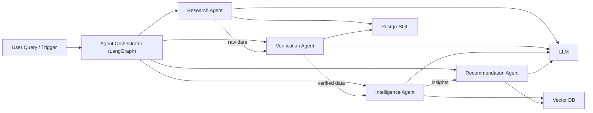
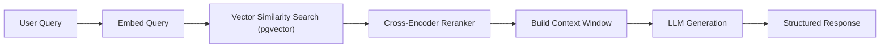
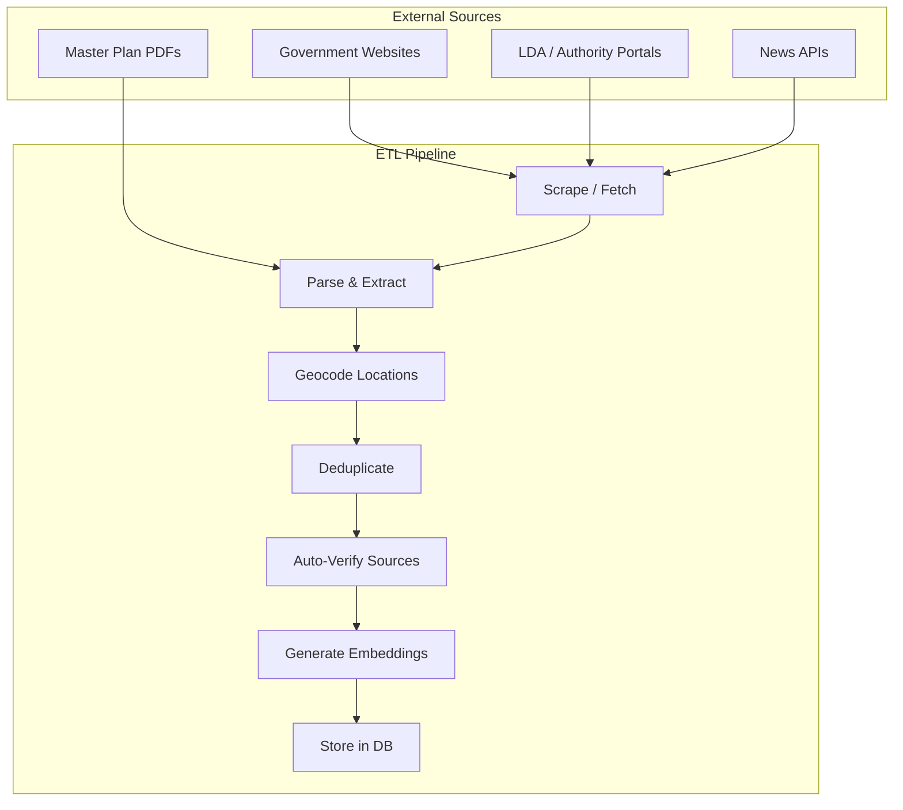
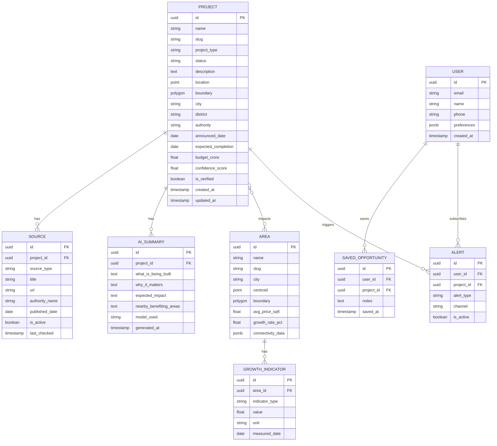
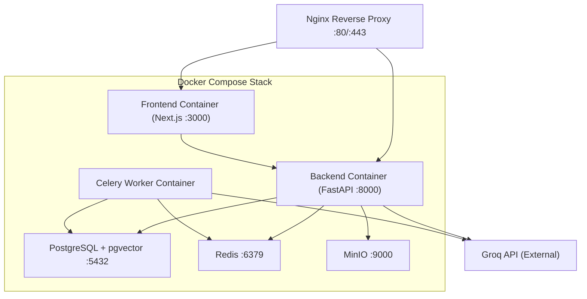
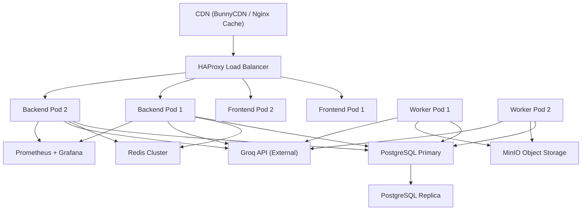

# LandScope AI — System Architecture

## 1. Architecture Overview

LandScope AI is an **AI-powered Property Intelligence Platform** designed to aggregate, verify, and present infrastructure project data so ordinary citizens can discover real-estate growth opportunities before prices appreciate.

The system follows a **layered, event-driven architecture** with four primary tiers:

```
┌─────────────────────────────────────────────────────────┐
│                    PRESENTATION LAYER                    │
│              Next.js (React) · Map UI · Chat UI          │
├─────────────────────────────────────────────────────────┤
│                      API GATEWAY                         │
│               FastAPI · REST + WebSocket                  │
├──────────────┬──────────────┬───────────────────────────┤
│  AI / AGENT  │   BUSINESS   │       DATA INGESTION      │
│    LAYER     │    LOGIC     │          PIPELINE          │
│  LangChain   │   Services   │  Scrapers · Parsers · ETL │
├──────────────┴──────────────┴───────────────────────────┤
│                      DATA LAYER                          │
│        PostgreSQL · pgvector · Redis · Object Store      │
└─────────────────────────────────────────────────────────┘
```

---

## 2. High-Level System Diagram

```mermaid
graph TB
    subgraph Client["Presentation Layer"]
        WebApp["Next.js Web App"]
        MapUI["Interactive Map (Leaflet + OSM)"]
        ChatUI["Ask AI Chat Interface"]
    end

    subgraph API["API Gateway"]
        Gateway["FastAPI Server"]
        AuthMW["Auth Middleware"]
        RateLimiter["Rate Limiter"]
    end

    subgraph AI["AI / Agent Layer"]
        ResearchAgent["Research Agent"]
        VerificationAgent["Verification Agent"]
        IntelligenceAgent["Intelligence Agent"]
        RecommendationAgent["Recommendation Agent"]
        RAG["RAG Pipeline"]
        LLM["LLM (Llama 3.3 70B via Groq)"]
    end

    subgraph Data["Data Layer"]
        PG["PostgreSQL"]
        PGVector["pgvector (Embeddings)"]
        Redis["Redis (Cache)"]
        ObjectStore["Object Store (Documents)"]
    end

    subgraph Ingestion["Data Ingestion Pipeline"]
        Scrapers["Web Scrapers"]
        Parsers["Document Parsers"]
        Geocoder["Geocoding Service"]
        Scheduler["Task Scheduler (Celery / APScheduler)"]
    end

    subgraph External["External Sources"]
        GovSites["Government Websites"]
        AuthNotices["Authority Notices"]
        NewsAPIs["News APIs"]
        MasterPlans["Master Plan PDFs"]
        MapTiles["Map Tile Provider"]
    end

    WebApp --> Gateway
    MapUI --> Gateway
    ChatUI --> Gateway
    Gateway --> AuthMW
    Gateway --> RateLimiter

    Gateway --> ResearchAgent
    Gateway --> VerificationAgent
    Gateway --> IntelligenceAgent
    Gateway --> RecommendationAgent
    Gateway --> RAG

    RAG --> PGVector
    RAG --> LLM
    ResearchAgent --> LLM
    VerificationAgent --> LLM
    IntelligenceAgent --> LLM
    RecommendationAgent --> LLM

    Gateway --> PG
    Gateway --> Redis

    Scheduler --> Scrapers
    Scheduler --> Parsers
    Scrapers --> GovSites
    Scrapers --> AuthNotices
    Scrapers --> NewsAPIs
    Parsers --> MasterPlans
    Scrapers --> Geocoder
    Parsers --> PG
    Scrapers --> PG
    Parsers --> ObjectStore

    MapUI --> MapTiles
```



---

## 3. Technology Stack

> **Open-Source Models, Cloud Inference** — The stack uses open-source models and self-hosted infrastructure wherever possible. LLM inference is handled by Groq's free-tier API for ultra-fast responses (LPU hardware), while all other components remain fully self-hosted.

| Layer | Technology | License | Rationale |
|-------|-----------|---------|----------|
| **Frontend** | Next.js 14 (App Router) | MIT | SSR/SSG for SEO, React ecosystem, fast DX |
| **Map Engine** | Leaflet + OpenStreetMap | BSD-2 / ODbL | Fully free; no API keys required for tiles |
| **Styling** | Tailwind CSS | MIT | Rapid UI development, responsive design |
| **Backend API** | FastAPI (Python 3.11+) | MIT | Async, high-performance, auto-generated OpenAPI docs |
| **Task Queue** | Celery + Redis | BSD / BSD-3 | Distributed background job processing |
| **Scheduler** | APScheduler / Celery Beat | MIT / BSD | Periodic scraping and data refresh |
| **Database** | PostgreSQL 16 + PostGIS | PostgreSQL / GPLv2 | Relational data + geospatial queries |
| **Vector Store** | pgvector extension | PostgreSQL | Embeddings co-located with relational data |
| **Cache** | Redis (or Valkey) | BSD-3 / BSD-3 | API response caching, session management |
| **Object Store** | MinIO (self-hosted) | AGPLv3 | S3-compatible PDF and document storage |
| **LLM** | Llama 3.3 70B (via Groq API) | Meta Llama 3.3 Community / - | Ultra-fast inference via Groq LPU; 128K context; strong multilingual support |
| **LLM (Fallback)** | Llama 3.1 8B Instant (via Groq API) | Meta Llama 3.1 Community / - | Blazing-fast fallback (~1200 tok/s); lower latency for simple queries |
| **AI Framework** | LangChain + LangGraph | MIT | Agent orchestration, RAG pipeline, tool use |
| **Embeddings** | bge-base-en-v1.5 (sentence-transformers) | MIT | 768-dim; state-of-the-art retrieval quality; runs on CPU; fully local |
| **Embeddings (Phase 2)** | bge-m3 (sentence-transformers) | MIT | 1024-dim; multilingual (Hindi + English); for Phase 2 Hindi support |
| **Reranker** | cross-encoder/ms-marco-MiniLM-L-6-v2 | Apache 2.0 | Lightweight cross-encoder for RAG reranking |
| **Geocoding** | Nominatim (self-hosted OSM) | GPLv2 | Free address → lat/lng; no API quotas |
| **PDF Parsing** | PyMuPDF (fitz) + pdfplumber | AGPLv3 / MIT | Robust open-source PDF text extraction |
| **Auth** | NextAuth.js (frontend) + JWT (backend) | ISC / - | Secure user authentication |
| **Deployment** | Docker Compose (MVP) → Kubernetes (Scale) | Apache 2.0 | Containerised, reproducible deployments |
| **CI/CD** | GitHub Actions / Gitea Actions | - / MIT | Automated testing and deployment |
| **Monitoring** | Prometheus + Grafana | Apache 2.0 / AGPLv3 | Metrics, alerting, dashboards |
| **AI Observability** | Phoenix (Arize) | Apache 2.0 | Open-source LLM tracing and evaluation |

---

## 4. Component Architecture

### 4.1 Presentation Layer (Frontend)

```
frontend/
├── app/
│   ├── (auth)/
│   │   ├── login/
│   │   └── register/
│   ├── (dashboard)/
│   │   ├── map/                  # Infrastructure Opportunity Map
│   │   ├── projects/[id]/        # Individual project detail
│   │   ├── area/[slug]/          # Area Intelligence page
│   │   ├── ask-ai/               # Chat-based AI assistant
│   │   └── saved/                # Saved opportunities
│   ├── layout.tsx
│   └── page.tsx                  # Landing page
├── components/
│   ├── map/
│   │   ├── MapContainer.tsx
│   │   ├── ProjectMarker.tsx
│   │   ├── ProjectCluster.tsx
│   │   └── MapFilters.tsx
│   ├── projects/
│   │   ├── ProjectCard.tsx
│   │   ├── ProjectDetail.tsx
│   │   ├── SourceBadge.tsx
│   │   └── StatusIndicator.tsx
│   ├── ai/
│   │   ├── ChatWindow.tsx
│   │   ├── MessageBubble.tsx
│   │   └── SuggestedQueries.tsx
│   └── common/
│       ├── Header.tsx
│       ├── Sidebar.tsx
│       ├── SearchBar.tsx
│       └── Footer.tsx
├── lib/
│   ├── api.ts                    # API client
│   ├── mapUtils.ts
│   └── formatters.ts
└── styles/
    └── globals.css
```

**Key UI Pages:**

| Page | Route | Feature Mapping |
|------|-------|-----------------|
| Infrastructure Map | `/map` | Interactive map with project markers, filters by type/status |
| Project Detail | `/projects/:id` | AI summary, source verification, impact analysis |
| Area Intelligence | `/area/:slug` | Nearby projects, growth indicators, connectivity |
| Ask AI | `/ask-ai` | Conversational interface for property queries |
| Saved Opportunities | `/saved` | User's bookmarked projects and areas |

---

### 4.2 API Layer (Backend)

```
backend/
├── app/
│   ├── main.py                   # FastAPI application entry
│   ├── config.py                 # Environment & settings
│   ├── api/
│   │   ├── v1/
│   │   │   ├── projects.py       # /api/v1/projects
│   │   │   ├── areas.py          # /api/v1/areas
│   │   │   ├── search.py         # /api/v1/search
│   │   │   ├── ai.py             # /api/v1/ai/ask
│   │   │   ├── map.py            # /api/v1/map/markers
│   │   │   ├── users.py          # /api/v1/users
│   │   │   └── alerts.py         # /api/v1/alerts (Phase 2)
│   │   └── deps.py               # Shared dependencies
│   ├── models/
│   │   ├── project.py
│   │   ├── area.py
│   │   ├── source.py
│   │   ├── user.py
│   │   └── alert.py
│   ├── schemas/
│   │   ├── project.py
│   │   ├── area.py
│   │   ├── ai.py
│   │   └── common.py
│   ├── services/
│   │   ├── project_service.py
│   │   ├── area_service.py
│   │   ├── search_service.py
│   │   ├── map_service.py
│   │   └── user_service.py
│   ├── agents/
│   │   ├── research_agent.py
│   │   ├── verification_agent.py
│   │   ├── intelligence_agent.py
│   │   ├── recommendation_agent.py
│   │   └── orchestrator.py       # Agent coordination
│   ├── rag/
│   │   ├── pipeline.py
│   │   ├── embeddings.py
│   │   ├── retriever.py
│   │   └── prompts.py
│   ├── ingestion/
│   │   ├── scrapers/
│   │   │   ├── base_scraper.py
│   │   │   ├── gov_scraper.py
│   │   │   ├── news_scraper.py
│   │   │   └── lda_scraper.py
│   │   ├── parsers/
│   │   │   ├── pdf_parser.py
│   │   │   └── html_parser.py
│   │   ├── geocoder.py
│   │   └── scheduler.py
│   └── db/
│       ├── session.py
│       ├── migrations/
│       └── seed.py
├── tests/
├── alembic.ini
└── requirements.txt
```

---

### 4.3 AI Agent Layer

The AI system is composed of **four specialised agents** coordinated by an **orchestrator** using LangGraph.



#### Agent Specifications

| Agent | Trigger | Tools | Output |
|-------|---------|-------|--------|
| **Research Agent** | Scheduled (daily) + on-demand | Web scraper, PDF parser, News API client, Geocoder | Raw project records stored in PostgreSQL |
| **Verification Agent** | Post-ingestion hook | Source validator, Cross-reference checker, Status tracker | Verified flag, confidence score, source links |
| **Intelligence Agent** | On project view / area search | RAG retriever, Summariser, Impact analyser | AI summary, growth insights, area report |
| **Recommendation Agent** | On user query (Ask AI) | Budget filter, Area ranker, Opportunity scorer | Personalised recommendations with reasoning |

#### RAG Pipeline



- **Chunk Strategy**: Documents split by project boundary → section-level chunks (300–500 tokens).
- **Embedding Model**: `bge-base-en-v1.5` (768 dims, via sentence-transformers) — runs on CPU, no GPU required. Upgrade to `bge-m3` (1024 dims, multilingual) in Phase 2 for Hindi support.
- **Reranker**: `cross-encoder/ms-marco-MiniLM-L-6-v2` — lightweight cross-encoder, runs locally.
- **Retrieval**: Top-k = 10, then reranked to top-5 using the cross-encoder.
- **LLM Generation**: Llama 3.3 70B via Groq API (ultra-fast LPU inference). Llama 3.1 8B Instant as fallback.
- **Context Window**: Retrieved chunks + project metadata + user context.

---

### 4.4 Data Ingestion Pipeline



**Schedule:**

| Task | Frequency | Description |
|------|-----------|-------------|
| Government site scrape | Daily (2 AM IST) | Fetch latest project updates |
| News aggregation | Every 6 hours | Scan news APIs for infrastructure mentions |
| PDF processing | On upload / weekly | Parse authority PDFs and master plans |
| Embedding refresh | Post-ingestion | Re-embed updated project documents |
| Source re-verification | Weekly | Re-check source URLs for validity |

---

## 5. Data Models

### 5.1 Core Entities



### 5.2 Vector Storage (pgvector)

| Table | Purpose | Embedding Source |
|-------|---------|-----------------|
| `project_embeddings` | Semantic search over projects | Project name + description + AI summary |
| `source_embeddings` | RAG over source documents | Parsed document text chunks |
| `area_embeddings` | Area-based semantic search | Area name + description + indicators |

---

## 6. API Design

### 6.1 REST Endpoints

| Method | Endpoint | Description |
|--------|----------|-------------|
| `GET` | `/api/v1/projects` | List projects (filterable by type, status, city) |
| `GET` | `/api/v1/projects/:id` | Get project details with sources and AI summary |
| `GET` | `/api/v1/projects/nearby` | Geo-query: projects within radius of lat/lng |
| `GET` | `/api/v1/areas` | List areas with growth indicators |
| `GET` | `/api/v1/areas/:slug` | Area intelligence report |
| `GET` | `/api/v1/areas/:slug/projects` | Projects impacting a specific area |
| `GET` | `/api/v1/map/markers` | GeoJSON markers for map rendering |
| `GET` | `/api/v1/map/clusters` | Clustered markers for zoom levels |
| `GET` | `/api/v1/search` | Full-text + semantic search |
| `POST` | `/api/v1/ai/ask` | Ask AI — conversational query |
| `POST` | `/api/v1/ai/summary/:projectId` | Generate / refresh AI summary |
| `POST` | `/api/v1/users/saved` | Save an opportunity |
| `GET` | `/api/v1/users/saved` | List saved opportunities |
| `POST` | `/api/v1/alerts` | Create alert subscription (Phase 2) |

### 6.2 WebSocket

| Channel | Purpose |
|---------|---------|
| `ws://host/ws/ai/chat` | Real-time streaming for Ask AI responses |
| `ws://host/ws/alerts` | Push notifications for project updates (Phase 2) |

### 6.3 Example: Ask AI Request/Response

**Request:**
```json
POST /api/v1/ai/ask
{
  "query": "Where should I buy land under ₹20 lakh near upcoming metro stations?",
  "filters": {
    "city": "lucknow",
    "budget_max": 2000000,
    "project_types": ["metro"]
  },
  "conversation_id": "uuid-optional"
}
```

**Response:**
```json
{
  "answer": "Based on current Lucknow Metro Phase 2 expansion plans...",
  "sources": [
    {
      "project_id": "uuid",
      "project_name": "Lucknow Metro Phase 2 – CCS Airport to Vasant Kunj",
      "source_url": "https://lmrcl.com/...",
      "relevance_score": 0.92
    }
  ],
  "recommended_areas": [
    {
      "area": "Vasant Kunj",
      "avg_price_sqft": 2800,
      "growth_potential": "High",
      "distance_to_project_km": 1.2
    }
  ],
  "disclaimer": "This information is AI-generated from public sources..."
}
```

---

## 7. Infrastructure & Deployment

### 7.1 MVP Deployment (Docker Compose)



### 7.2 Environment Configuration

```
# .env (MVP)
DATABASE_URL=postgresql://user:pass@db:5432/landscape_ai
REDIS_URL=redis://cache:6379/0

# LLM — Groq API (free tier: 30 req/min, 14,400 req/day)
GROQ_API_KEY=gsk_your_api_key_here
LLM_MODEL=llama-3.3-70b-versatile       # Primary model (128K context)
LLM_FALLBACK_MODEL=llama-3.1-8b-instant # Fast fallback (~1200 tok/s)

# Embeddings — Local sentence-transformers (no API key needed)
EMBEDDING_MODEL=BAAI/bge-base-en-v1.5
EMBEDDING_DIMENSIONS=768
# Phase 2 (Hindi support): Upgrade to multilingual embeddings
# EMBEDDING_MODEL=BAAI/bge-m3
# EMBEDDING_DIMENSIONS=1024

# Reranker — Local cross-encoder
RERANKER_MODEL=cross-encoder/ms-marco-MiniLM-L-6-v2

MAP_TILE_URL=https://{s}.tile.openstreetmap.org/{z}/{x}/{y}.png
MINIO_ENDPOINT=minio:9000
MINIO_ACCESS_KEY=<key>
MINIO_SECRET_KEY=<key>
JWT_SECRET=<secret>
SCRAPE_SCHEDULE_CRON=0 2 * * *
```

### 7.3 Production Architecture (Phase 2+)



---

## 8. Security Considerations

| Concern | Approach |
|---------|----------|
| Authentication | JWT tokens with refresh rotation; NextAuth.js on frontend |
| Authorisation | Role-based access (user, admin, scraper-service) |
| Data Validation | Pydantic schemas on all API inputs |
| Rate Limiting | Redis-backed rate limiter (100 req/min per user) |
| Scraping Ethics | Respect `robots.txt`, rate-limit outbound requests, cache aggressively |
| LLM Safety | Output guardrails, disclaimer on AI-generated content |
| Data Privacy | No PII stored beyond user account; GDPR-style deletion support |
| HTTPS | TLS termination at Nginx / Load Balancer |

---

## 9. Monitoring & Observability

| Component | Tool | License | Metrics |
|-----------|------|---------|--------|
| Application | Prometheus + Grafana | Apache 2.0 / AGPLv3 | API latency, error rates, throughput |
| Logs | Loki + Grafana | AGPLv3 | Structured JSON logs, error tracing |
| AI Pipelines | Phoenix (Arize OSS) | Apache 2.0 | Token usage, latency, quality scores, trace visualization |
| LLM API | Groq API response metrics | - | API latency, token usage, rate limit headroom, error rates |
| Uptime | Uptime Kuma (self-hosted) | MIT | Endpoint availability, status pages |
| Scraper Health | Custom Grafana dashboard | - | Scrape success rate, data freshness |

---

## 10. Phased Delivery Roadmap

### Phase 1 — MVP (Week 1)

| Component | Deliverable |
|-----------|-------------|
| Frontend | Map page, Project detail page, basic search |
| Backend | Projects CRUD, Geo-query, Search API |
| AI | Intelligence Agent (summaries), basic Ask AI |
| Data | Seed data for 20–30 Lucknow projects (manually curated + scraped) |
| Infra | Docker Compose local deployment |

### Phase 2 — Intelligence Layer (Weeks 2–3)

| Component | Deliverable |
|-----------|-------------|
| AI Agents | All 4 agents operational with LangGraph orchestration |
| RAG | Full pipeline with pgvector retrieval |
| Area Intelligence | Area pages with growth indicators |
| Scoring | Opportunity Score (5 dimensions) |
| Data | Automated daily scraping pipeline |

### Phase 3 — User Features (Weeks 4–5)

| Component | Deliverable |
|-----------|-------------|
| Auth | User registration, login, profiles |
| Saved Opportunities | Bookmark and notes |
| Alerts | Email/push notifications on project updates |
| Distress Properties | Undervalued property listings |
| AI Assistant | Budget-based recommendations, area comparisons |

### Phase 4 — Scale & Polish (Weeks 6–8)

| Component | Deliverable |
|-----------|-------------|
| Multi-city | Expand beyond Lucknow |
| Performance | Caching, query optimization, CDN |
| Monitoring | Full observability stack |
| Mobile | Responsive PWA or React Native wrapper |
| Analytics | User metrics dashboard, search analytics |

---

## 11. Key Design Decisions

| Decision | Choice | Rationale |
|----------|--------|-----------|
| pgvector over Pinecone/Weaviate | pgvector | Simpler ops — single DB for relational + vector data; sufficient for MVP scale |
| FastAPI over Django | FastAPI | Async-first, lighter weight, native OpenAPI docs; better for AI service integration |
| LangGraph over raw LangChain | LangGraph | Stateful multi-agent orchestration with conditional routing |
| Leaflet over Google Maps | Leaflet + OSM | Fully open-source, no API key for tiles, no usage quotas |
| Llama 3.3 via Groq over GPT-4 / Gemini | Llama 3.3 70B via Groq API | Free tier available; ultra-fast LPU inference (~250 tok/s); open-source model; 128K context; no GPU hardware needed |
| BGE over OpenAI Embeddings | bge-base-en-v1.5 via sentence-transformers | Runs on CPU; no API dependency; 768-dim; state-of-the-art retrieval quality; upgrade to bge-m3 for Hindi |
| Nominatim over Google Geocoding | Self-hosted Nominatim | Free, unlimited geocoding from OSM data; no API key or quota |
| Phoenix over LangSmith | Phoenix (Arize OSS) | Open-source LLM observability; self-hosted; no vendor lock-in |
| Monorepo | Single repo | Easier to manage in 1-week MVP sprint; split later if needed |

---

## 12. Risks & Mitigations

| Risk | Impact | Mitigation |
|------|--------|------------|
| Government site structure changes | Scrapers break | Abstract scraper interface; monitoring + alerts on failures |
| LLM hallucination | Incorrect recommendations | Always cite sources; display confidence scores; add disclaimers |
| Data freshness | Outdated project info | Automated re-scrape schedule; show "last updated" prominently |
| Geocoding inaccuracy | Misplaced map markers | Manual review for seed data; fallback to district-level placement |
| Scale beyond Lucknow | Schema/scraper rework | Design data model city-agnostic from day 1 |
| Groq API rate limits | Throttled AI responses at scale | Free tier: 30 req/min, 14,400/day. Cache frequent responses. Upgrade to paid tier for production. Use Llama 3.1 8B Instant as fast fallback. |
| Groq API downtime or deprecation | All AI features unavailable | Circuit breaker pattern; cache AI summaries aggressively; consider secondary LLM provider (e.g., Together AI) as backup |
| Open-source model quality vs proprietary | Lower quality summaries | Llama 3.3 70B closes quality gap significantly; use RAG heavily to ground responses; iterative prompt engineering |
