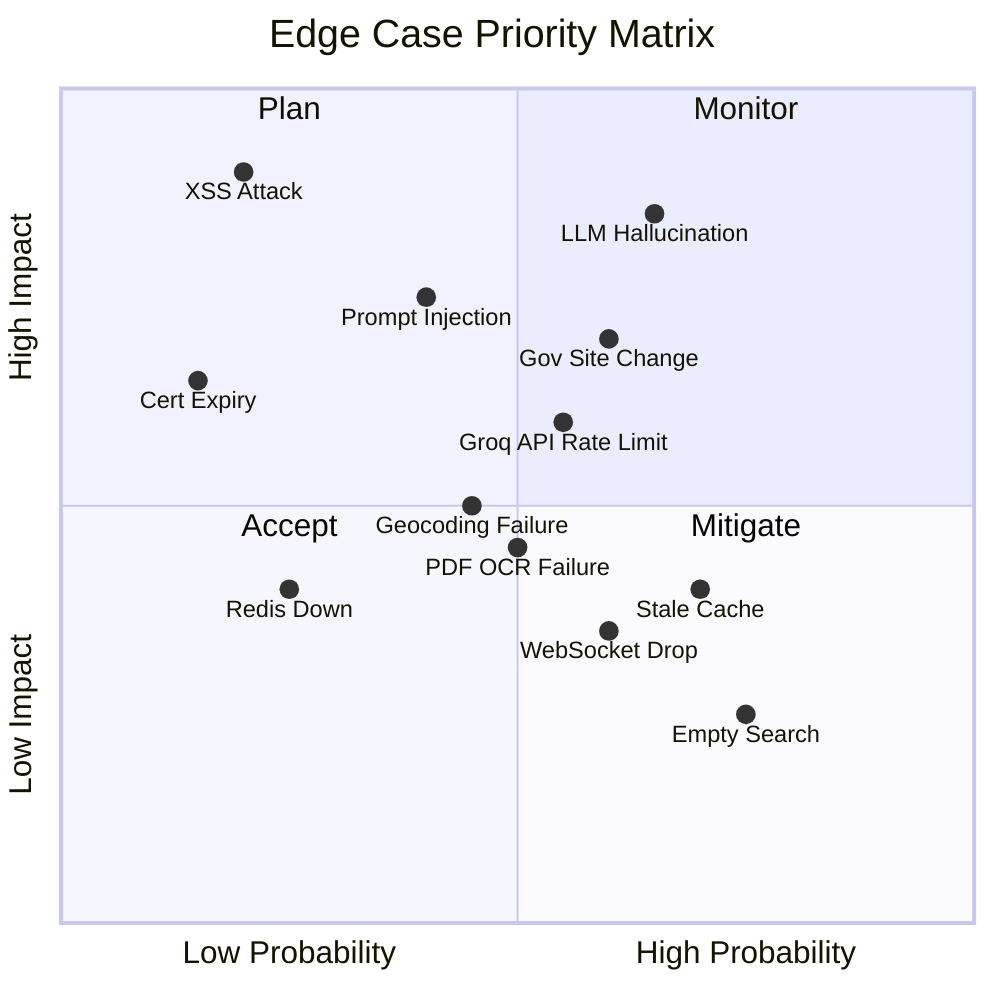

# LandScope AI — Edge Cases & Error Handling

> Comprehensive catalogue of edge cases across every layer of the system, derived from the [architecture document](file:///e:/PM_Portfolio_Projects/InfraLens/Docs/architecture.md).

---

## 1. Data Ingestion & Scraping

### 1.1 Government Website Edge Cases

| # | Edge Case | Impact | Handling Strategy |
|---|-----------|--------|-------------------|
| 1.1.1 | Government website is **completely down** or returns 5xx | No new data ingested | Retry with exponential backoff (3 attempts, 5m/15m/60m). Log failure. Mark last successful scrape time. Alert if down > 24h. |
| 1.1.2 | Website **structure changes** (HTML layout, CSS classes, DOM) | Scraper breaks silently, returns empty or garbage data | Validate scraped output against expected schema. If field count < minimum threshold, halt ingestion and alert. Maintain scraper version per site. |
| 1.1.3 | Website returns **valid HTML but no project data** (empty listing) | Could falsely mark projects as removed | Never delete existing projects based on absence. Only flag "not found in latest scrape" for manual review. |
| 1.1.4 | Website serves **CAPTCHA or anti-bot page** | Scraper returns CAPTCHA HTML instead of data | Detect CAPTCHA patterns (e.g., reCAPTCHA scripts, challenge pages). Log and switch to manual fallback queue. |
| 1.1.5 | Website uses **JavaScript-rendered content** (SPA) | Requests-based scraper returns empty body | Detect empty body. Fall back to headless browser (Playwright) for JS-heavy sites. Cache rendered HTML. |
| 1.1.6 | **Robots.txt changes** to disallow scraping | Legal and ethical compliance risk | Check robots.txt before every scrape run. Respect disallow rules. Switch to manual data entry for blocked sites. |
| 1.1.7 | Website returns **stale/cached data** (CDN cache not cleared) | Ingested data appears unchanged despite real updates | Compare content hashes. Track `Last-Modified` / `ETag` headers. Cross-reference with news sources. |
| 1.1.8 | **Rate limiting / IP blocking** by government site | Temporary or permanent scrape failure | Use configurable delays between requests (2-5s). Rotate user-agent strings. Use residential proxies as last resort. |

### 1.2 PDF Parsing Edge Cases

| # | Edge Case | Impact | Handling Strategy |
|---|-----------|--------|-------------------|
| 1.2.1 | PDF is a **scanned image** (no selectable text) | Parser returns empty text | Detect image-only PDFs. Fall back to OCR (Tesseract). Flag as "low-confidence extraction" in metadata. |
| 1.2.2 | PDF is **password-protected** | Parser cannot open file | Catch exception. Log with source URL. Add to manual review queue. |
| 1.2.3 | PDF is **corrupt or truncated** | Parser crashes or returns partial data | Validate PDF structure before parsing. Catch `PyMuPDF` exceptions. Re-download and retry once. |
| 1.2.4 | PDF contains **tables as images** (master plan layouts) | Table data not extracted | Detect image-heavy pages. Use OCR + layout detection (LayoutParser). Flag for human review. |
| 1.2.5 | PDF is **very large** (> 100 MB, 500+ pages) | Memory exhaustion, slow processing | Set max file size limit (50 MB). Process in chunks (page ranges). Stream to disk, not memory. |
| 1.2.6 | PDF contains **Hindi/Devanagari text** | Default OCR/parser may not handle correctly | Use Tesseract with `hin` language pack. Validate character encoding post-extraction. |
| 1.2.7 | PDF has **multiple columns or complex layout** | Text extraction in wrong reading order | Use `pdfplumber` with layout analysis. Detect multi-column layouts. Apply column-aware extraction. |

### 1.3 News Scraping Edge Cases

| # | Edge Case | Impact | Handling Strategy |
|---|-----------|--------|-------------------|
| 1.3.1 | News article is a **duplicate** of an already ingested article | Duplicate project entries or conflated sources | Content hash deduplication. Fuzzy title matching (> 85% similarity = duplicate). |
| 1.3.2 | News article is a **rumour or speculative** (unconfirmed project) | Unverified project enters the system | Classify confidence: "Official" vs "News Report" vs "Rumoured". Don't display rumoured projects without 2+ independent sources. |
| 1.3.3 | News article contains **incorrect location** or project details | Misleading map marker or summary | Cross-reference with official sources. Flag discrepancies for review. Show "Unverified" badge. |
| 1.3.4 | **Paywall-blocked** news article | Cannot access full article text | Detect paywall patterns. Use RSS description/snippet only. Mark source as "partial". |
| 1.3.5 | News article **URL becomes 404** after a few days | Dead source link shown to users | Periodic link validation (weekly). Archive source content at ingestion time. Show "Archived" badge when original is dead. |

### 1.4 Geocoding Edge Cases

| # | Edge Case | Impact | Handling Strategy |
|---|-----------|--------|-------------------|
| 1.4.1 | Location name is **ambiguous** (e.g., "Gomti Nagar" exists in multiple cities) | Wrong city/location plotted | Always include city context in geocoding query ("Gomti Nagar, Lucknow, India"). Validate result falls within Lucknow bounding box. |
| 1.4.2 | Location is a **new area** not yet in OSM / Nominatim | Geocoder returns no result | Fallback to district centroid. Flag as "approximate location". Add manual coordinate override field. |
| 1.4.3 | Project spans a **linear route** (expressway, metro line) not a point | Single point marker misrepresents project extent | Use polyline/polygon geometry instead of point. Store both: representative point (for markers) + full route (for detail view). |
| 1.4.4 | Geocoder returns **low confidence result** | Marker placed far from actual location | Check Nominatim `importance` score. If < threshold (0.3), flag for manual review. |
| 1.4.5 | Nominatim self-hosted instance **runs out of disk** or is down | All geocoding fails | Health check Nominatim before scrape runs. Queue failed geocoding attempts for retry. Fall back to cached coordinates. |
| 1.4.6 | **Multiple valid coordinates** for same project name | Inconsistent map placement across updates | Pin coordinates on first successful geocode. Only update if manual override or high-confidence new result. |

---

## 2. AI / LLM Layer

### 2.1 Groq API & Model Edge Cases

| # | Edge Case | Impact | Handling Strategy |
|---|-----------|--------|-------------------|
| 2.1.1 | Groq API is **down or returning 5xx errors** | All AI features fail (summaries, Ask AI) | Health check Groq API on startup. Circuit breaker pattern — disable AI features gracefully after 3 consecutive failures. Show "AI temporarily unavailable" with cached responses as fallback. |
| 2.1.2 | **Groq API rate limit hit** (free tier: 30 req/min, 14,400 req/day) | AI requests rejected with 429 | Request queue with rate-aware scheduling. Switch to `llama-3.1-8b-instant` (higher rate limit). Cache frequent query responses. Show "AI is busy, please try again in X seconds." |
| 2.1.3 | LLM inference is **slower than expected** (Groq degradation) | User experiences delay or timeout | Set 20s timeout. Stream partial response to frontend. If no tokens in 5s, retry with `llama-3.1-8b-instant` (faster model). Show progress indicator. |
| 2.1.4 | LLM returns **empty response** | No answer shown to user | Detect empty/whitespace-only response. Retry once with rephrased prompt. If still empty, return "Could not generate a response. Try rephrasing your question." |
| 2.1.5 | LLM generates **hallucinated project names or data** | User sees fabricated information | RAG-only mode: LLM must only reference retrieved documents. Post-generation validation: check that cited project IDs exist in DB. Strip any ungrounded claims. |
| 2.1.6 | LLM generates **harmful or inappropriate content** | Trust and safety violation | Output guardrails: regex filter for profanity, financial guarantees, legal advice. Prefix system prompt with safety instructions. |
| 2.1.7 | User sends **prompt injection** via Ask AI | LLM reveals system prompt or behaves unexpectedly | Sanitise user input. Use separate system and user message roles. Never concatenate user input into system prompt. |
| 2.1.8 | **Groq API key expires, is revoked, or billing limit reached** | All AI requests fail with 401/403 | Monitor API key validity on startup. Alert immediately on auth errors. Document key rotation procedure. Keep backup API key in vault. |
| 2.1.9 | **Network connectivity to Groq API lost** (server-side) | AI features unavailable despite Groq being healthy | Detect network errors (timeout, DNS failure). Retry with exponential backoff. Show "AI service unreachable" message. Cache AI summaries aggressively so static content still works. |
| 2.1.10 | LLM generates response in **wrong language** (Hindi query, English response or vice versa) | Poor UX for non-English users | Detect query language. Include language instruction in prompt: "Respond in the same language as the user's query." Validate response language. |

### 2.2 RAG Pipeline Edge Cases

| # | Edge Case | Impact | Handling Strategy |
|---|-----------|--------|-------------------|
| 2.2.1 | **No relevant documents** found in vector search | LLM generates response without grounding | Set minimum similarity threshold (0.3). If no docs pass threshold, return "No relevant projects found for your query. Try broader terms." Do NOT let LLM generate ungrounded response. |
| 2.2.2 | **All retrieved documents are about the same project** | Narrow, repetitive response | Deduplicate by `project_id` before sending to LLM. Ensure top-5 contains 3+ unique projects (if available). |
| 2.2.3 | Embedding model **produces inconsistent dimensions** | pgvector insert/query fails | Validate embedding dimension before insert. If mismatch, re-generate with correct model. Alert on dimension mismatches. |
| 2.2.4 | **Stale embeddings** after project data update | Search returns outdated information | Post-update hook: re-embed modified projects immediately. Track `embedding_generated_at` timestamp. Alert if embedding is > 7 days older than project `updated_at`. |
| 2.2.5 | User query is **extremely short** (1-2 words, e.g., "metro") | Poor embedding quality, irrelevant results | Expand short queries: add city context ("metro Lucknow infrastructure project"). Use keyword search as fallback for queries < 3 words. |
| 2.2.6 | User query is **extremely long** (500+ words) | Exceeds embedding model max token limit | Truncate to 256 tokens for embedding. Extract key phrases for search. Warn user: "Your query was shortened for search." |
| 2.2.7 | Cross-encoder reranker **fails or times out** | Unreranked results passed to LLM | Skip reranking; use raw similarity scores. Log reranker failure. Results slightly less relevant but still functional. |
| 2.2.8 | **Embedding model server** (sentence-transformers) crashes | No new embeddings generated, search degraded | Use pre-computed embeddings (cached). Queue embedding generation for later. Restart embedding service via Docker. |

### 2.3 AI Summary Edge Cases

| # | Edge Case | Impact | Handling Strategy |
|---|-----------|--------|-------------------|
| 2.3.1 | Project has **very little source data** (one short paragraph) | LLM generates vague or padded summary | Detect low-data projects (< 100 words of source text). Generate shorter summary. Add badge: "Limited information available." |
| 2.3.2 | Source documents **contradict each other** (different completion dates, different project scopes) | Summary contains conflicting information | Instruct LLM to note discrepancies: "Sources differ on completion date (2026 vs 2027)." Prioritise official government sources. |
| 2.3.3 | Summary generation **times out** mid-generation | Partial or no summary saved | Use transaction: only save complete summaries. If timeout, retry once. If still failing, mark project as "Summary pending." |
| 2.3.4 | Generated summary is **identical** to another project's summary | Copy-paste hallucination | Post-generation: hash-compare new summary against existing summaries. If > 90% similarity to different project, regenerate with more specific context. |

---

## 3. API & Backend

### 3.1 Request Handling Edge Cases

| # | Edge Case | Impact | Handling Strategy |
|---|-----------|--------|-------------------|
| 3.1.1 | Request for **non-existent project ID** | 404 or crash | Return `404 Not Found` with `{ "detail": "Project not found" }`. Never leak internal DB errors. |
| 3.1.2 | Request with **invalid UUID format** for project ID | Validation error or DB error | Pydantic validation on path params. Return `422 Unprocessable Entity` with clear field error. |
| 3.1.3 | Geo-query with **coordinates outside India** | Empty results or irrelevant data | Validate lat/lng bounds: India bounding box (6.5 to 37.5 N, 68 to 97.5 E). Return `400 Bad Request: "Coordinates outside supported region."` |
| 3.1.4 | Geo-query with **radius = 0 or negative radius** | No results or DB error | Validate `radius > 0 AND radius <= 100` km. Default to 5 km if not specified. |
| 3.1.5 | Search query with **SQL injection attempt** | Database compromise | Parameterised queries only (SQLAlchemy ORM). Never use raw SQL with user input. Input sanitisation on all string params. |
| 3.1.6 | Search query with **special characters** (%, _, Unicode) | Unexpected search results or errors | Escape `%` and `_` in LIKE queries. Handle Unicode normalisation for Hindi text. |
| 3.1.7 | **Extremely large pagination** request (`page_size=10000`) | Memory exhaustion, slow response | Cap `page_size` at 100. Default to 20. Return `400` if exceeded. |
| 3.1.8 | **Concurrent requests** to same endpoint from same user | Unnecessary load; potential race conditions on writes | Rate limiting: 100 req/min per user. Idempotency keys for POST requests. Optimistic locking on writes. |
| 3.1.9 | Request with **expired or invalid JWT token** | Unauthorised access or crash | Return `401 Unauthorized`. Include `WWW-Authenticate` header. Frontend should redirect to login. |
| 3.1.10 | **CORS preflight** request from unknown origin | API rejects legitimate frontend request | Configure CORS whitelist. Include localhost origins in dev mode. Log rejected origins. |

### 3.2 Database Edge Cases

| # | Edge Case | Impact | Handling Strategy |
|---|-----------|--------|-------------------|
| 3.2.1 | **PostgreSQL connection pool exhausted** | All API requests fail with "connection refused" | Configure pool size (20 min, 50 max). Connection timeout: 5s. Queue requests briefly. Return `503 Service Unavailable` if pool full. |
| 3.2.2 | **Duplicate project insert** (same project scraped twice) | Duplicate entries in DB | Unique constraint on `(name, city, authority)`. Use `INSERT ... ON CONFLICT DO UPDATE` for upserts. |
| 3.2.3 | **PostGIS geometry invalid** (self-intersecting polygon, invalid coordinates) | Spatial queries crash | Validate geometry with `ST_IsValid()` before insert. Use `ST_MakeValid()` to fix common issues. Reject with clear error if unfixable. |
| 3.2.4 | **Migration fails** on production DB | App won't start or data lost | Always test migrations on staging first. Use `alembic downgrade` capability. Take DB snapshot before migration. |
| 3.2.5 | **pgvector index not created** or corrupted | Slow similarity search (full table scan) | Check index health on startup. Rebuild index if missing. Monitor query plan with `EXPLAIN ANALYZE`. |
| 3.2.6 | **Disk space full** on database server | Writes fail, potential data corruption | Monitor disk usage. Alert at 80% capacity. Set up log rotation. Archive old data (completed projects > 2 years old). |

### 3.3 Redis Cache Edge Cases

| # | Edge Case | Impact | Handling Strategy |
|---|-----------|--------|-------------------|
| 3.3.1 | **Redis is down** | Cache misses for all requests; slower responses | Treat Redis as optional - all endpoints work without it (just slower). Log cache failures. Auto-reconnect. |
| 3.3.2 | **Stale cache** after data update | Users see outdated data | Cache invalidation on write: delete relevant keys when project/area data changes. TTL-based expiry (5 min for lists, 1 hour for map markers). |
| 3.3.3 | **Cache stampede** (many concurrent misses for same key) | All requests hit DB simultaneously | Use cache locking (Redis `SET NX` + short TTL). Only one request populates cache; others wait or use stale data. |
| 3.3.4 | **Redis memory full** | Eviction of important cached data | Configure `maxmemory-policy: allkeys-lru`. Monitor memory usage. Alert at 80%. |

---

## 4. Frontend & User Experience

### 4.1 Map Edge Cases

| # | Edge Case | Impact | Handling Strategy |
|---|-----------|--------|-------------------|
| 4.1.1 | **OpenStreetMap tile server is down** | Map shows grey/blank tiles | Fallback tile URL (e.g., alternate OSM mirror). Show placeholder message: "Map tiles temporarily unavailable." Data layer still functional. |
| 4.1.2 | **Hundreds of markers** at same location (clustered projects) | Map unusable, markers overlap | Use marker clustering (Leaflet.markercluster). Show cluster count. Expand on click/zoom. |
| 4.1.3 | User zooms to **global level** (zoom = 1) | All projects collapse to tiny area; confusing UX | Set `minZoom: 8` and `maxBounds` to Lucknow region (MVP). Show prompt: "Zoom in to see projects." |
| 4.1.4 | Map fails to load on **low-end mobile device** | Blank screen, JavaScript crash | Detect device performance. Reduce marker count (paginate). Disable animations on low-end devices. Offer "list view" fallback. |
| 4.1.5 | User has **no GPS/location permission** | "Near me" feature doesn't work | Don't require GPS. Default to city centre. If location denied, hide "near me" button gracefully. |
| 4.1.6 | Project has **no coordinates** (geocoding failed) | Missing from map but exists in DB | Show in list view with "Location unavailable" badge. Exclude from map API but include in search/list endpoints. |
| 4.1.7 | **Touch gestures conflict** on mobile (scroll vs pan vs zoom) | Map captures scroll, user can't scroll page | Use two-finger scroll on map. Show "Use two fingers to move the map" overlay. Allow single-tap for markers. |

### 4.2 Ask AI Chat Edge Cases

| # | Edge Case | Impact | Handling Strategy |
|---|-----------|--------|-------------------|
| 4.2.1 | User sends **empty message** | API error or useless response | Disable send button until input has 3+ characters. Client-side validation. |
| 4.2.2 | User sends **extremely long message** (10,000+ chars) | Token limit exceeded, slow processing | Client-side limit: 1,000 characters. Show character counter. Truncate with warning if exceeded. |
| 4.2.3 | User sends **non-real-estate query** ("What is the weather?") | Irrelevant response or hallucination | System prompt: "You are a real estate and infrastructure assistant. Politely decline off-topic queries." Detect off-topic with keyword check. |
| 4.2.4 | User sends **rapid-fire messages** (spam clicking send) | Multiple concurrent LLM requests, resource exhaustion | Debounce: disable send for 2s after submission. Queue messages. Only process latest if multiple pending. |
| 4.2.5 | **WebSocket connection drops** mid-streaming | Partial response displayed, no way to continue | Detect disconnect. Reconnect automatically. Show "Connection lost. Reconnecting..." banner. Resume or restart response. |
| 4.2.6 | User asks a question in **Hindi** | LLM may not respond in Hindi well | Test Hindi response quality with Llama 3.3 70B via Groq. Include Hindi system prompt variant. Fall back to English with disclaimer if Hindi quality is poor. |
| 4.2.7 | **Session expires** during long conversation | User loses conversation context | Persist conversation in `localStorage`. On re-auth, restore conversation. Show "Session expired" modal with login link. |
| 4.2.8 | User asks for **specific legal advice** ("Is this land legal to buy?") | Liability risk | System prompt: "Never provide legal advice. Always recommend consulting a qualified lawyer." Append disclaimer to legal-adjacent responses. |

### 4.3 Search & Navigation Edge Cases

| # | Edge Case | Impact | Handling Strategy |
|---|-----------|--------|-------------------|
| 4.3.1 | Search returns **zero results** | User sees empty state | Show friendly empty state: "No projects found. Try a broader search." Suggest popular searches. |
| 4.3.2 | Area name **typo or misspelling** | No autocomplete match | Fuzzy matching in autocomplete (Levenshtein distance <= 2). Suggest "Did you mean...?" |
| 4.3.3 | User bookmarks a **project URL that is later deleted** | 404 page | Show "This project has been removed or merged." Suggest similar projects. |
| 4.3.4 | **Browser back button** on map page doesn't restore state | Filters/zoom lost | Sync map state (zoom, center, filters) to URL query params. Restore on back navigation. |
| 4.3.5 | **Slow network** (2G/3G) | Loading spinners, abandoned sessions | Skeleton loaders for all components. Lazy-load map tiles. Prioritise text content over images. Service worker for offline-capable caching. |

---

## 5. Authentication & User Data

| # | Edge Case | Impact | Handling Strategy |
|---|-----------|--------|-------------------|
| 5.1 | User **registers with disposable email** | Fake accounts, spam | Block known disposable email domains. Optional: email verification link required before saving opportunities. |
| 5.2 | User tries to **save > 100 opportunities** | Storage bloat | Enforce limit per user (100 for free tier). Show "Limit reached" message. Suggest removing old saves. |
| 5.3 | **JWT token forged** or tampered | Unauthorized access | Verify JWT signature server-side. Use short expiry (15 min access, 7-day refresh). Rotate JWT secret periodically. |
| 5.4 | User requests **account deletion** | GDPR compliance; data cleanup | Soft-delete user. Cascade-delete saved opportunities and alerts. Anonymise AI chat history. Confirm via email. Hard-delete after 30 days. |
| 5.5 | **Two users save the same project** simultaneously | No conflict; independent bookmarks | Each save is scoped to user_id. `UNIQUE (user_id, project_id)` constraint prevents duplicate saves by same user. |
| 5.6 | User **modifies saved opportunity notes** with XSS payload | Stored XSS attack | Sanitise all user-generated text (DOMPurify on frontend, bleach on backend). Escape HTML in templates. CSP headers to block inline scripts. |

---

## 6. Alerts & Notifications

| # | Edge Case | Impact | Handling Strategy |
|---|-----------|--------|-------------------|
| 6.1 | **Email delivery fails** (SMTP down, mailbox full) | User misses alert | Retry 3 times with backoff. Mark alert as "delivery failed" in DB. Show in-app notification as fallback. |
| 6.2 | User sets alert for area with **no upcoming projects** | Alert never fires | Set expectations: "No projects currently tracked in this area. You'll be notified when new projects appear." |
| 6.3 | **Project status changes rapidly** (Announced then Approved then Under Construction in 1 day) | Multiple alerts for same project | Aggregate alerts: batch status changes into single notification if within 24h window. |
| 6.4 | User has **100+ active alerts** | Performance impact on alert checker | Limit alerts per user (20). Batch process alerts in Celery worker. Index on `(user_id, is_active)`. |
| 6.5 | **Stale alert** for project that has been completed or cancelled | Irrelevant notification | Auto-disable alerts for completed/cancelled projects. Notify user: "This project is now complete. Alert deactivated." |

---

## 7. Infrastructure & DevOps

| # | Edge Case | Impact | Handling Strategy |
|---|-----------|--------|-------------------|
| 7.1 | **Docker container OOM-killed** (especially PostgreSQL or Celery workers) | Service crashes, restart loop | Set memory limits per container. Monitor with `docker stats`. Alert on OOM events. Tune connection pool sizes. |
| 7.2 | **Nginx reverse proxy misconfigured** | 502 Bad Gateway for all requests | Validate Nginx config before reload (`nginx -t`). Health check backends before routing. Maintain rollback config. |
| 7.3 | **Let's Encrypt certificate expires** | HTTPS errors, users can't access site | Auto-renewal cron job (certbot). Alert 14 days before expiry. Monitoring check for SSL validity. |
| 7.4 | **Disk full on server** | All writes fail, potential data corruption | Alert at 80% disk usage. Log rotation for all services. Archive old scrape data. MinIO lifecycle policies for old documents. |
| 7.5 | **Docker Compose update** breaks existing config | Stack won't start | Pin Docker Compose version. Test upgrades in staging. Maintain `docker-compose.yml` versioned in git. |
| 7.6 | **Groq API terms of service change** or model deprecation | Need to switch models or providers | Abstract LLM calls behind provider interface (LangChain makes this easy). Monitor Groq announcements. Have Together AI or Fireworks as backup provider. |
| 7.7 | **Redis and PostgreSQL restart simultaneously** | Data inconsistency between cache and DB | Cache is always derived from DB (cache-aside pattern). On Redis restart, cache warms naturally. No data loss. |
| 7.8 | **Celery worker dies** mid-task | Scraping job partially completed | Use `acks_late=True`: task re-queued on worker death. Idempotent tasks: safe to re-run. Dead letter queue for repeatedly failing tasks. |

---

## 8. Data Quality & Consistency

| # | Edge Case | Impact | Handling Strategy |
|---|-----------|--------|-------------------|
| 8.1 | **Same project** scraped from different sources with **different names** | Duplicate projects in DB | Fuzzy deduplication: project name similarity > 85% + same city + same project type = likely duplicate. Manual merge queue. |
| 8.2 | Project **budget figures** in different units (crore vs lakh vs million) | Inconsistent data display | Normalise all budgets to INR Crore during ingestion. Store raw value + unit. Display in user-friendly format. |
| 8.3 | Project **dates in different formats** (DD/MM/YYYY, YYYY-MM-DD, "March 2027") | Parse errors or wrong dates | Multi-format date parser (dateutil). Store as ISO 8601. Fall back to year-only if precise date unavailable. |
| 8.4 | **Project status** terminology varies by source ("sanctioned" vs "approved" vs "passed") | Inconsistent status filtering | Normalise to enum: `ANNOUNCED`, `APPROVED`, `UNDER_CONSTRUCTION`, `COMPLETED`, `ON_HOLD`, `CANCELLED`. Map synonyms during ingestion. |
| 8.5 | Project has **no sources** remaining (all URLs dead) | "Verified" project with zero active sources | Auto-demote to "Unverified" if all sources fail link check. Show "Sources no longer available" badge. Retain archived content. |
| 8.6 | **Area boundaries overlap** (Gomti Nagar Extension overlaps with Gomti Nagar) | Double-counted projects in area search | Handle with explicit spatial relationships. Use `ST_Contains`/`ST_Intersects` queries. Display: "This project also appears in nearby areas." |

---

## 9. Performance & Scalability

| # | Edge Case | Impact | Handling Strategy |
|---|-----------|--------|-------------------|
| 9.1 | **50+ concurrent AI queries** | Groq API rate limit hit, requests rejected | Rate-aware request queue. Cache frequent query responses. Spread across primary + fallback models. Return "AI is processing other requests. Position in queue: X." Upgrade to Groq paid tier for higher limits. |
| 9.2 | **Map with 2000+ markers** (multi-city Phase 4) | Browser freezes, map unusable | Server-side clustering. Load markers only for current viewport (bounding box query). Paginate markers. Canvas renderer instead of SVG for 1000+ markers. |
| 9.3 | **Embedding generation** for 10,000+ documents | Multi-hour batch job blocks other processing | Process in batches of 100. Use dedicated Celery queue. Allow incremental: only embed new/modified documents. |
| 9.4 | **PostgreSQL query plan changes** after data growth | Previously fast query becomes slow | Monitor slow query log. Create indexes: `(city, project_type, status)`, spatial index on `location`, GIN index on `tsvector`. Run `ANALYZE` weekly. |
| 9.5 | **MinIO bucket grows** to 100+ GB | Storage costs, slow listing | Lifecycle policy: archive PDFs > 1 year to cold storage. Delete processed temp files. Compress stored documents. |

---

## 10. Security Edge Cases

| # | Edge Case | Impact | Handling Strategy |
|---|-----------|--------|-------------------|
| 10.1 | **XSS via project name or description** (if sourced from scraped data) | Script execution in user's browser | Sanitise all scraped text at ingestion. HTML-escape on render. CSP: `script-src 'self'`. |
| 10.2 | **SSRF via Ask AI** (user asks LLM to fetch a URL) | Server makes unintended outbound requests | LLM has NO internet access. No URL-fetch tools given to agents. Sandboxed execution. |
| 10.3 | **Brute-force login attempts** | Account compromise | Rate limit login: 5 attempts per 15 minutes per IP. Account lockout after 10 failed attempts. CAPTCHA after 3 failures. |
| 10.4 | **Man-in-the-middle** on HTTP (no HTTPS) | Data interception | Enforce HTTPS everywhere. HSTS header. Redirect HTTP to HTTPS. |
| 10.5 | **Insider threat** via admin endpoints | Data tampering, project deletion | Admin actions require separate auth token. Audit log all admin operations. Two-person rule for bulk deletions. |
| 10.6 | **Scraped source URL contains malicious redirect** | User clicks source link then lands on phishing site | Validate source URLs at ingestion (check domain whitelist). Warn users before opening external links. Scan URLs with safety check. |

---

## 11. Edge Case Severity Matrix

---

## 12. Summary Statistics

| Category | Edge Cases Documented | Critical (Must-Handle for MVP) |
|----------|----------------------|-------------------------------|
| Data Ingestion & Scraping | 28 | 8 |
| AI / LLM Layer | 22 | 10 |
| API & Backend | 20 | 8 |
| Frontend & UX | 12 | 5 |
| Authentication | 6 | 3 |
| Alerts & Notifications | 5 | 2 |
| Infrastructure & DevOps | 8 | 4 |
| Data Quality | 6 | 4 |
| Performance | 5 | 2 |
| Security | 6 | 4 |
| **Total** | **118** | **50** |

---

## Related Documents

| Document | Path |
|----------|------|
| Problem Statement | [problemstatement.md](file:///e:/PM_Portfolio_Projects/InfraLens/Docs/problemstatement.md) |
| System Architecture | [architecture.md](file:///e:/PM_Portfolio_Projects/InfraLens/Docs/architecture.md) |
| Product Requirements | [PRD.md](file:///e:/PM_Portfolio_Projects/InfraLens/Docs/PRD.md) |
| Implementation Plan | [implementationplan.md](file:///e:/PM_Portfolio_Projects/InfraLens/Docs/implementationplan.md) |
