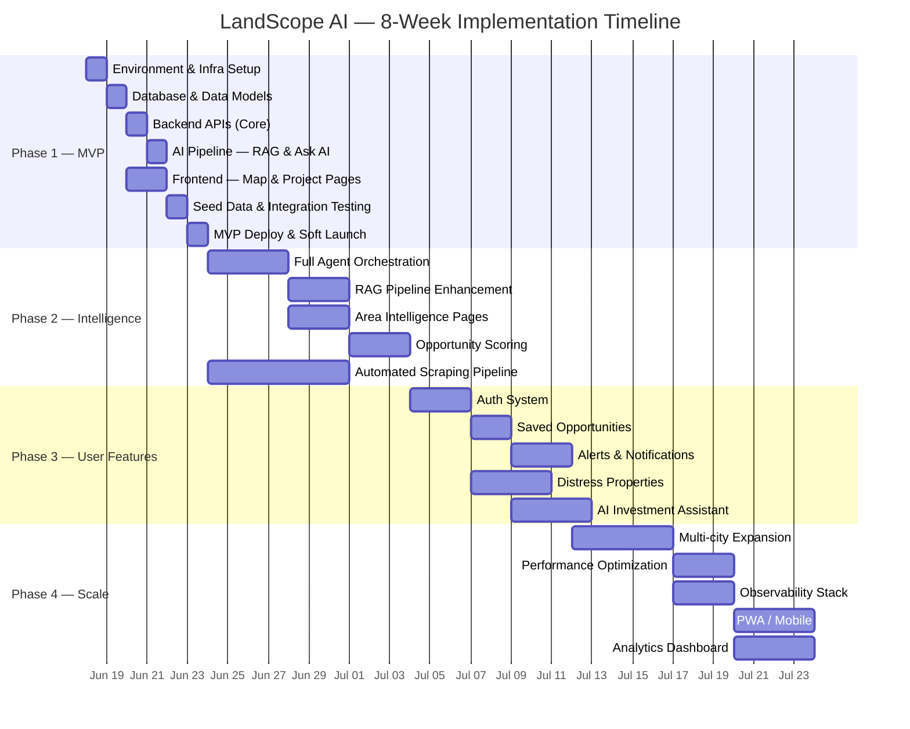
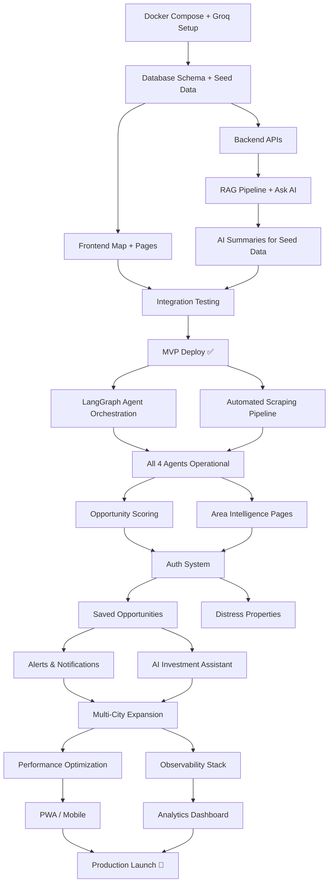

# LandScope AI — Implementation Plan

## Document Overview

| Field | Detail |
|-------|--------|
| **Project** | LandScope AI — Property Intelligence Platform |
| **Duration** | 8 Weeks (4 Phases) |
| **MVP Target** | Week 1 — Lucknow only |
| **Stack** | Next.js · FastAPI · PostgreSQL + pgvector · Groq (Llama 3.3 70B) · Leaflet + OSM |
| **Approach** | Monorepo · Docker Compose · Fully open-source |

---

## Phase Overview



---

## Phase 1 — MVP (Week 1)

> **Goal**: Ship a working prototype for Lucknow with map, project data, AI summaries, and Ask AI.

---

### Day 1 — Environment & Infrastructure Setup

| # | Task | Output | Est. |
|---|------|--------|------|
| 1.1 | Initialise monorepo structure (`frontend/`, `backend/`, `docker/`, `docs/`) | Repo scaffold | 1h |
| 1.2 | Create `docker-compose.yml` with all services: Next.js, FastAPI, PostgreSQL + pgvector, Redis, MinIO, Nginx | Running stack | 2h |
| 1.3 | Set up Groq API key — register at [console.groq.com](https://console.groq.com), generate API key, add to `.env` | `GROQ_API_KEY` configured | 15m |
| 1.4 | Set up PostgreSQL with PostGIS + pgvector extensions enabled | DB accepting connections | 30m |
| 1.5 | Create `.env` file with all environment variables (Groq API key + local services) | Config ready | 15m |
| 1.6 | Initialise Next.js 14 app with App Router, Tailwind CSS | Frontend running at `:3000` | 30m |
| 1.7 | Initialise FastAPI project with Pydantic, SQLAlchemy, Alembic | Backend running at `:8000` | 30m |
| 1.8 | Verify full stack boots with `docker-compose up` | All containers healthy | 30m |

**Checkpoint**: All 6 containers running, frontend and backend reachable via Nginx. Groq API connectivity verified.

---

### Day 2 — Database & Data Models

| # | Task | Output | Est. |
|---|------|--------|------|
| 2.1 | Define SQLAlchemy models: `Project`, `Source`, `AISummary`, `Area`, `GrowthIndicator` | `models/*.py` | 2h |
| 2.2 | Create Pydantic schemas for all models (request/response) | `schemas/*.py` | 1h |
| 2.3 | Set up Alembic migrations, generate initial migration | `migrations/` populated | 30m |
| 2.4 | Run migrations — create all tables with PostGIS geometry columns | Tables in DB | 15m |
| 2.5 | Create pgvector tables: `project_embeddings`, `source_embeddings`, `area_embeddings` | Vector tables ready | 30m |
| 2.6 | Write seed script for 10 Lucknow projects with sources (manual curation) | `seed.py` + `seed_data.json` | 2h |
| 2.7 | Run seed script, verify data in DB | 10 projects queryable | 15m |

**Checkpoint**: Database populated with 10 verified Lucknow infrastructure projects.

---

### Day 3 — Backend APIs (Core)

| # | Task | Output | Est. |
|---|------|--------|------|
| 3.1 | `GET /api/v1/projects` — List with filters (type, status, city) + pagination | Endpoint live | 1h |
| 3.2 | `GET /api/v1/projects/:id` — Detail with sources and AI summary | Endpoint live | 45m |
| 3.3 | `GET /api/v1/projects/nearby` — Geo-query using PostGIS `ST_DWithin` | Endpoint live | 1h |
| 3.4 | `GET /api/v1/map/markers` — Return GeoJSON FeatureCollection for map | Endpoint live | 45m |
| 3.5 | `GET /api/v1/map/clusters` — Clustered markers by zoom level | Endpoint live | 1h |
| 3.6 | `GET /api/v1/areas/:slug` — Area intelligence with nearby projects | Endpoint live | 1h |
| 3.7 | `GET /api/v1/search` — Full-text search using PostgreSQL `tsvector` | Endpoint live | 1h |
| 3.8 | Add Redis caching middleware for list/map endpoints | Cached responses | 30m |
| 3.9 | Write unit tests for all endpoints | `tests/test_api/` | 1h |

**Checkpoint**: All read APIs passing tests, returning correct data from seed DB.

---

### Day 4 — AI Pipeline (RAG + Ask AI)

| # | Task | Output | Est. |
|---|------|--------|------|
| 4.1 | Set up sentence-transformers (`bge-base-en-v1.5`) embedding service | `rag/embeddings.py` | 1h |
| 4.2 | Generate embeddings for all seed projects + sources, store in pgvector | Vectors in DB | 30m |
| 4.3 | Build RAG retriever — pgvector similarity search + cross-encoder reranker | `rag/retriever.py` | 1.5h |
| 4.4 | Create LangChain integration with Groq API (Llama 3.3 70B) | `rag/pipeline.py` | 1h |
| 4.5 | Build Intelligence Agent — generate AI summaries (4 sections per project) | `agents/intelligence_agent.py` | 1.5h |
| 4.6 | Generate AI summaries for all 10 seed projects, store in `ai_summary` table | Summaries in DB | 30m |
| 4.7 | Build `POST /api/v1/ai/ask` endpoint with RAG pipeline + streaming (WebSocket) | Ask AI working | 1.5h |
| 4.8 | Add prompt templates for Ask AI with source citation instructions | `rag/prompts.py` | 30m |
| 4.9 | Test AI responses — verify grounding, source citations, disclaimer | Manual QA | 30m |

**Checkpoint**: Ask AI returns grounded responses citing real projects. Summaries generated for all seed data.

---

### Day 5–6 — Frontend (Map + Project Pages)

| # | Task | Output | Est. |
|---|------|--------|------|
| 5.1 | Create API client (`lib/api.ts`) with fetch wrappers | Client module | 30m |
| 5.2 | Build landing page — hero section, value prop, CTA to map | `app/page.tsx` | 2h |
| 5.3 | Build `MapContainer` with Leaflet + OpenStreetMap tiles centered on Lucknow | `components/map/MapContainer.tsx` | 1.5h |
| 5.4 | Build `ProjectMarker` — colour-coded by project type with popup | `components/map/ProjectMarker.tsx` | 1h |
| 5.5 | Build `MapFilters` — filter sidebar for project type and status | `components/map/MapFilters.tsx` | 1h |
| 5.6 | Build map page (`/map`) — assemble map + filters + project list sidebar | `app/(dashboard)/map/page.tsx` | 1.5h |
| 5.7 | Build `ProjectCard` component — summary card for lists | `components/projects/ProjectCard.tsx` | 45m |
| 5.8 | Build `ProjectDetail` page — AI summary, source badges, status, map pin | `app/(dashboard)/projects/[id]/page.tsx` | 2h |
| 5.9 | Build `SourceBadge` + `StatusIndicator` components | `components/projects/` | 45m |
| 5.10 | Build Area Intelligence page — nearby projects, growth indicators | `app/(dashboard)/area/[slug]/page.tsx` | 1.5h |
| 5.11 | Build `SearchBar` with autocomplete for areas | `components/common/SearchBar.tsx` | 1h |
| 5.12 | Build Ask AI chat interface — message bubbles, streaming, suggested queries | `app/(dashboard)/ask-ai/page.tsx` | 2h |
| 5.13 | Build common layout — Header, Sidebar, Footer | `components/common/` | 1h |
| 5.14 | Mobile responsiveness pass — all pages 320px–2560px | CSS adjustments | 1h |

**Checkpoint**: All 5 key pages functional — Landing, Map, Project Detail, Area Intelligence, Ask AI.

---

### Day 7 — Seed Data, Integration Testing & Deploy

| # | Task | Output | Est. |
|---|------|--------|------|
| 7.1 | Curate remaining seed data — expand to 20–25 Lucknow projects | Updated `seed_data.json` | 2h |
| 7.2 | Generate embeddings + AI summaries for new projects | Data in DB | 30m |
| 7.3 | End-to-end testing: Map → Project → Ask AI flow | Test report | 1.5h |
| 7.4 | Fix critical bugs from testing | Bug fixes | 1.5h |
| 7.5 | Configure Nginx reverse proxy with SSL (self-signed for MVP) | HTTPS working | 30m |
| 7.6 | Write deployment `README.md` with setup instructions | Documentation | 30m |
| 7.7 | Deploy Docker Compose stack to a VPS or local server | MVP live | 1h |
| 7.8 | Smoke test on deployed environment | Final validation | 30m |

**Checkpoint**: ✅ MVP deployed and accessible. 20+ projects, map, AI summaries, Ask AI all working.

---

## Phase 2 — Intelligence Layer (Weeks 2–3)

> **Goal**: Operationalise all 4 AI agents, build full RAG pipeline, implement area intelligence and opportunity scoring.

### Sprint 2A — Agent Orchestration (Week 2)

| # | Task | Component | Est. |
|---|------|-----------|------|
| 2A.1 | Install and configure LangGraph for multi-agent orchestration | `agents/orchestrator.py` | 4h |
| 2A.2 | Build Research Agent — scraper integration, PDF parser, geocoder tools | `agents/research_agent.py` | 6h |
| 2A.3 | Build Verification Agent — source validator, cross-reference checker | `agents/verification_agent.py` | 6h |
| 2A.4 | Enhance Intelligence Agent — area reports, growth insights | `agents/intelligence_agent.py` | 4h |
| 2A.5 | Build Recommendation Agent — budget filter, area ranker, opportunity scorer | `agents/recommendation_agent.py` | 6h |
| 2A.6 | Wire all agents through orchestrator with LangGraph conditional routing | `agents/orchestrator.py` | 4h |
| 2A.7 | Set up Phoenix (Arize OSS) for AI pipeline observability | `monitoring/phoenix/` | 3h |
| 2A.8 | Integration tests for agent workflows | `tests/test_agents/` | 4h |

### Sprint 2B — RAG + Area Intelligence (Week 3)

| # | Task | Component | Est. |
|---|------|-----------|------|
| 2B.1 | Enhance RAG pipeline — improved chunking, metadata enrichment | `rag/pipeline.py` | 4h |
| 2B.2 | Add semantic search endpoint (`GET /api/v1/search?mode=semantic`) | `api/v1/search.py` | 3h |
| 2B.3 | Build Area Intelligence pages — growth indicators, connectivity data | Frontend area pages | 6h |
| 2B.4 | Implement Opportunity Score engine (5 dimensions) | `services/scoring_service.py` | 8h |
| 2B.5 | Build automated scraping pipeline with Celery Beat scheduling | `ingestion/scheduler.py` | 6h |
| 2B.6 | Government site scrapers — LDA, LMRC, UP RERA | `ingestion/scrapers/` | 8h |
| 2B.7 | News scraper — RSS/API-based infrastructure news aggregation | `ingestion/scrapers/news_scraper.py` | 4h |
| 2B.8 | PDF parser for master plan documents | `ingestion/parsers/pdf_parser.py` | 4h |
| 2B.9 | Deduplication logic for scraped data | `ingestion/dedup.py` | 3h |
| 2B.10 | Post-ingestion hook — auto-embed + auto-verify + auto-summarise | `ingestion/hooks.py` | 4h |

**Phase 2 Checkpoint**: All 4 agents operational. Automated daily scraping. Opportunity scores visible. 50+ projects in DB.

---

## Phase 3 — User Features (Weeks 4–5)

> **Goal**: Add authentication, saved opportunities, alerts, distress properties, and AI investment assistant.

### Sprint 3A — Auth & Saved Opportunities (Week 4)

| # | Task | Component | Est. |
|---|------|-----------|------|
| 3A.1 | Set up NextAuth.js with email + password provider | Frontend auth | 4h |
| 3A.2 | Build JWT auth middleware for FastAPI | `api/deps.py` | 3h |
| 3A.3 | Create `User` registration + login endpoints | `api/v1/users.py` | 3h |
| 3A.4 | Build login/register UI pages | `app/(auth)/` | 4h |
| 3A.5 | Build user profile page with preferences | `app/(dashboard)/profile/` | 3h |
| 3A.6 | Implement `POST /api/v1/users/saved` — save opportunity with notes | `api/v1/users.py` | 2h |
| 3A.7 | Implement `GET /api/v1/users/saved` — list saved with project details | `api/v1/users.py` | 2h |
| 3A.8 | Build Saved Opportunities page | `app/(dashboard)/saved/` | 4h |
| 3A.9 | Add save/unsave button to ProjectCard and ProjectDetail | Components | 2h |

### Sprint 3B — Alerts, Distress Properties, AI Assistant (Week 5)

| # | Task | Component | Est. |
|---|------|-----------|------|
| 3B.1 | Build alert subscription model and endpoints | `api/v1/alerts.py` | 4h |
| 3B.2 | Implement email notification service (SMTP) | `services/notification_service.py` | 4h |
| 3B.3 | Build Celery task for checking alert triggers (project status changes) | `tasks/alert_checker.py` | 4h |
| 3B.4 | Build alerts management UI | `app/(dashboard)/alerts/` | 3h |
| 3B.5 | Ingest distress property data sources (auction sites, resale feeds) | `ingestion/scrapers/distress_scraper.py` | 6h |
| 3B.6 | Build distress property listing page | `app/(dashboard)/distress/` | 4h |
| 3B.7 | Enhance Recommendation Agent — budget workflows, area comparisons | `agents/recommendation_agent.py` | 6h |
| 3B.8 | Build AI Investment Assistant UI — guided flow with filters | `app/(dashboard)/invest/` | 5h |
| 3B.9 | WebSocket for real-time alert push (`ws://host/ws/alerts`) | `api/websocket.py` | 3h |

**Phase 3 Checkpoint**: Users can register, save opportunities, set alerts, browse distress properties, and get budget-based AI recommendations.

---

## Phase 4 — Scale & Polish (Weeks 6–8)

> **Goal**: Multi-city expansion, performance optimization, full observability, mobile support, and analytics dashboard.

### Sprint 4A — Multi-City & Performance (Week 6)

| # | Task | Component | Est. |
|---|------|-----------|------|
| 4A.1 | Abstract city-specific logic (scrapers, geocoding, area data) | Refactor ingestion layer | 8h |
| 4A.2 | Add 2 new cities — seed data curation + scrapers | Data pipeline | 8h |
| 4A.3 | City selector UI — global city switch in header | Frontend | 3h |
| 4A.4 | Implement Redis caching strategy — TTL-based cache for API responses | Backend | 4h |
| 4A.5 | PostgreSQL query optimization — indexes, EXPLAIN ANALYZE, connection pooling | Database | 4h |
| 4A.6 | Map tile caching via Nginx proxy cache | Nginx config | 2h |
| 4A.7 | Implement API response compression (gzip/brotli) | Nginx config | 1h |

### Sprint 4B — Observability & Mobile (Week 7)

| # | Task | Component | Est. |
|---|------|-----------|------|
| 4B.1 | Deploy Prometheus + Grafana stack | `docker/monitoring/` | 4h |
| 4B.2 | Instrument FastAPI with Prometheus metrics (latency, error rate, throughput) | Backend middleware | 3h |
| 4B.3 | Deploy Loki for centralized log aggregation | `docker/monitoring/` | 3h |
| 4B.4 | Build Grafana dashboards — API health, scraper health, AI pipeline | Grafana JSON | 4h |
| 4B.5 | Deploy Uptime Kuma for endpoint monitoring | `docker/monitoring/` | 2h |
| 4B.6 | PWA configuration — manifest.json, service worker, offline support | Frontend | 4h |
| 4B.7 | Mobile responsiveness deep pass — touch gestures on map, bottom sheets | Frontend CSS | 4h |
| 4B.8 | Lighthouse audit and performance fixes | Frontend | 3h |

### Sprint 4C — Analytics & Launch (Week 8)

| # | Task | Component | Est. |
|---|------|-----------|------|
| 4C.1 | Implement event tracking (page views, map interactions, AI queries) | Frontend + Backend | 6h |
| 4C.2 | Build analytics dashboard — MAU, searches, saved opportunities, AI usage | `app/(admin)/analytics/` | 6h |
| 4C.3 | SEO optimization — meta tags, OG images, sitemap.xml, robots.txt | Frontend | 3h |
| 4C.4 | Write end-user documentation / FAQ | `docs/user-guide.md` | 3h |
| 4C.5 | Security audit — input validation, rate limiting, CORS, CSP headers | Full stack | 4h |
| 4C.6 | Load testing with Locust — identify bottlenecks | `tests/load/` | 4h |
| 4C.7 | Final bug bash and polish | Full stack | 4h |
| 4C.8 | Production deployment — Kubernetes or VPS with Docker Compose | Infrastructure | 4h |
| 4C.9 | Launch announcement + seed initial users | Marketing | 2h |

**Phase 4 Checkpoint**: 3+ cities live. Full observability. PWA ready. Analytics tracking. Production-grade deployment.

---

## Dependency Graph



---

## Environment Setup Checklist

### Prerequisites

| Requirement | Minimum | Recommended |
|-------------|---------|-------------|
| **CPU** | 4 cores | 8 cores |
| **RAM** | 16 GB | 32 GB |
| **GPU** | None (CPU inference works) | NVIDIA with 8+ GB VRAM |
| **Disk** | 50 GB SSD | 100 GB SSD |
| **Docker** | v24+ | Latest |
| **Docker Compose** | v2.20+ | Latest |
| **Node.js** | v18 LTS | v20 LTS |
| **Python** | 3.11+ | 3.12 |

### First-Run Commands

```bash
# 1. Clone repository
git clone https://github.com/org/landscape-ai.git
cd landscape-ai

# 2. Copy environment file
cp .env.example .env

# 3. Start all services
docker-compose up -d

# 4. Run database migrations
docker exec backend alembic upgrade head

# 5. Seed initial data
docker exec backend python -m app.db.seed

# 6. Generate embeddings for seed data
docker exec backend python -m app.rag.embeddings --generate-all

# 7. Generate AI summaries for all projects
docker exec backend python -m app.agents.intelligence_agent --summarise-all

# 8. Verify
curl http://localhost/api/v1/projects  # Should return project list
open http://localhost                   # Should show landing page
```

---

## Testing Strategy

| Level | Tool | Scope | When |
|-------|------|-------|------|
| **Unit Tests** | pytest | Models, services, utils | Every PR |
| **API Tests** | pytest + httpx | All REST endpoints | Every PR |
| **Integration Tests** | pytest + Docker | DB queries, RAG pipeline, Groq API calls | Daily |
| **Frontend Tests** | Vitest + React Testing Library | Components, pages | Every PR |
| **E2E Tests** | Playwright | Critical user flows (Map → Project → Ask AI) | Pre-deploy |
| **Load Tests** | Locust | API throughput, concurrent AI queries | Weekly (Phase 4) |
| **AI Quality Tests** | Custom eval framework | RAG relevance, hallucination detection, source accuracy | Post-ingestion |

### AI-Specific Test Cases

| Test | Method | Pass Criteria |
|------|--------|---------------|
| RAG Relevance | Query 20 known questions, check top-5 retrieved docs | ≥ 80% contain relevant project |
| Hallucination Check | Compare AI summary facts against source documents | 0 unsupported claims |
| Source Citation | Verify every AI response includes ≥1 valid source link | 100% citation rate |
| Latency | Measure Ask AI end-to-end response time | First token < 3s, full response < 15s |
| Fallback | Simulate Groq API error (mock 429/503), verify Llama 3.1 8B Instant auto-fallback | Response still generated |

---

## Go-Live Checklist

### MVP (Week 1)

- [ ] All containers healthy (`docker-compose ps`)
- [ ] 20+ projects visible on map with correct locations
- [ ] Project detail pages show AI summaries and sources
- [ ] Ask AI returns grounded responses with citations
- [ ] Area search returns nearby projects
- [ ] Mobile-responsive on 375px viewport
- [ ] HTTPS configured (self-signed OK for MVP)
- [ ] All source links valid and opening in new tabs
- [ ] Disclaimer displayed on AI-generated content
- [ ] README with setup instructions complete

### Production (Week 8)

- [ ] Kubernetes / Docker Compose production config
- [ ] TLS with Let's Encrypt
- [ ] Rate limiting active (100 req/min per IP)
- [ ] Redis caching enabled for map and list endpoints
- [ ] Prometheus + Grafana dashboards operational
- [ ] Uptime Kuma monitoring all endpoints
- [ ] Automated daily scraping running on schedule
- [ ] Email alerts configured and tested
- [ ] Lighthouse score > 90 (Performance, Accessibility, SEO)
- [ ] Load test: handles 50 concurrent users without degradation
- [ ] Backup strategy documented and tested
- [ ] User documentation / FAQ published
- [ ] Security headers (CORS, CSP, HSTS) configured

---

## Risk-Contingency Table

| Risk | Probability | Impact | Contingency | Owner |
|------|------------|--------|-------------|-------|
| Groq API rate limit hit during high traffic | Medium | High | Cache frequent AI responses. Queue requests with backoff. Upgrade to Groq paid tier if needed. Use Llama 3.1 8B Instant (higher rate limit) as fallback. | DevOps |
| Seed data geocoding places markers in wrong locations | Medium | Medium | Manual lat/lng review for all seed projects before launch | Data |
| Government website blocks scraper | Medium | Medium | Rotate user-agents; add delays; manual data entry fallback | Backend |
| LLM generates inaccurate summaries | Medium | High | RAG-ground all responses; add "Report Issue" button; human review queue | AI |
| Docker Compose won't start on dev machine (port conflicts) | Low | Low | Document port overrides in `.env`; provide alternate ports | DevOps |
| Week 1 scope creep | High | High | Strict P0-only; all P1/P2 deferred to Phase 2+ | PM |
| pgvector embedding search returns irrelevant results | Medium | Medium | Tune similarity threshold; add keyword pre-filter; improve chunking | AI |

---

## Related Documents

| Document | Path |
|----------|------|
| Problem Statement | [problemstatement.md](file:///e:/PM_Portfolio_Projects/InfraLens/Docs/problemstatement.md) |
| System Architecture | [architecture.md](file:///e:/PM_Portfolio_Projects/InfraLens/Docs/architecture.md) |
| Product Requirements | [PRD.md](file:///e:/PM_Portfolio_Projects/InfraLens/Docs/PRD.md) |
| Edge Cases | [edgecase.md](file:///e:/PM_Portfolio_Projects/InfraLens/Docs/edgecase.md) |
